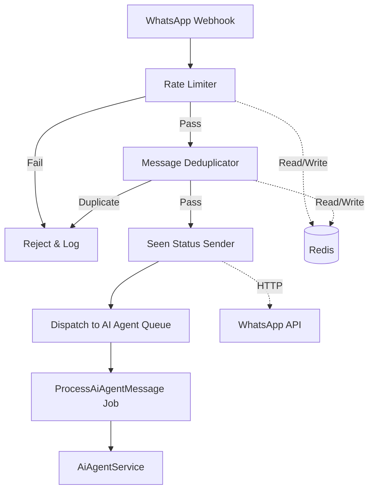

# Design Document: AI Agent Anti-Spam Workflow

## Overview

This design document describes the implementation of an anti-spam and message validation workflow for the AI Agent system. The workflow will be integrated into the existing WhatsApp message processing pipeline to prevent abuse through rate limiting, provide user feedback via read receipts, and prevent duplicate message processing.

The workflow will be implemented as a series of validation steps that execute before the AI Agent processes incoming messages. Each step can halt the workflow if validation fails, ensuring that only legitimate messages reach the AI Agent processing logic.

## Architecture

### High-Level Flow

```
WhatsApp Webhook → Rate Limiting Check → Message Deduplication → Mark as Read → AI Agent Processing
                         ↓                      ↓                      ↓
                    [Reject if limit]     [Skip if duplicate]    [Send seen status]
```

### Integration Points

The anti-spam workflow will integrate with the existing system at the following points:

1. **WhatsAppWebhookController**: The webhook controller receives incoming messages and currently dispatches them directly to `ProcessAiAgentMessage` job. We will add validation steps before dispatching.

2. **ProcessAiAgentMessage Job**: This job currently calls `AiAgentService::processMessage()`. The job will remain unchanged, but the webhook controller will only dispatch it after validation passes.

3. **Redis**: Used for storing rate limit counters and deduplication keys with TTL support.

4. **WhatsApp API**: Used for sending "seen" status back to users.

### Component Diagram



## Components and Interfaces

### 1. RateLimiter Service

**Purpose**: Track and enforce message rate limits per user to prevent spam.

**Location**: `app/Services/RateLimiter.php`

**Methods**:

```php
class RateLimiter
{
    /**
     * Check if user has exceeded rate limit
     * 
     * @param string $phoneNumber User's WhatsApp phone number
     * @return bool True if under limit, false if exceeded
     */
    public function checkLimit(string $phoneNumber): bool;
    
    /**
     * Increment the message counter for a user
     * 
     * @param string $phoneNumber User's WhatsApp phone number
     * @return int Current count after increment
     */
    public function incrementCounter(string $phoneNumber): int;
    
    /**
     * Get current message count for a user
     * 
     * @param string $phoneNumber User's WhatsApp phone number
     * @return int Current message count
     */
    public function getCount(string $phoneNumber): int;
}
```

**Implementation Details**:
- Redis key format: `rateLimit#{phoneNumber}`
- TTL: 86400 seconds (24 hours) - configurable
- Limit: 20 messages per day - configurable
- Uses Redis `INCR` command for atomic increment
- Uses Redis `EXPIRE` command to set TTL on first increment

### 2. MessageDeduplicator Service

**Purpose**: Detect and prevent duplicate message processing.

**Location**: `app/Services/MessageDeduplicator.php`

**Methods**:

```php
class MessageDeduplicator
{
    /**
     * Check if message is a duplicate
     * 
     * @param string $phoneNumber User's WhatsApp phone number
     * @param string $messageContent The message text content
     * @return bool True if duplicate, false if unique
     */
    public function isDuplicate(string $phoneNumber, string $messageContent): bool;
    
    /**
     * Mark message as seen to prevent future duplicates
     * 
     * @param string $phoneNumber User's WhatsApp phone number
     * @param string $messageContent The message text content
     * @return void
     */
    public function markAsSeen(string $phoneNumber, string $messageContent): void;
}
```

**Implementation Details**:
- Redis key format: `dedup#{phoneNumber}#{contentHash}`
- Content hash: MD5 hash of message content
- TTL: Configurable (default: 300 seconds / 5 minutes)
- Uses Redis `SET` with `NX` (only set if not exists) and `EX` (expiry) options

### 3. SeenStatusSender Service

**Purpose**: Send "seen" status to WhatsApp to provide user feedback.

**Location**: `app/Services/SeenStatusSender.php`

**Methods**:

```php
class SeenStatusSender
{
    /**
     * Send seen status to WhatsApp for a message
     * 
     * @param WhatsAppAccount $account The WhatsApp account
     * @param string $messageId The WhatsApp message ID
     * @return bool True if successful, false otherwise
     */
    public function sendSeenStatus(WhatsAppAccount $account, string $messageId): bool;
}
```

**Implementation Details**:
- Uses WhatsApp Cloud API endpoint: `POST /{phone_number_id}/messages`
- Request body: `{"messaging_product": "whatsapp", "status": "read", "message_id": "{messageId}"}`
- Uses user-specific access token from `WhatsAppAccount` model
- Logs errors but does not throw exceptions (graceful degradation)

### 4. AntiSpamWorkflow Service

**Purpose**: Orchestrate the complete anti-spam workflow.

**Location**: `app/Services/AntiSpamWorkflow.php`

**Methods**:

```php
class AntiSpamWorkflow
{
    /**
     * Validate incoming message through anti-spam workflow
     * 
     * @param WhatsAppAccount $account The WhatsApp account
     * @param WhatsAppContact $contact The contact sending the message
     * @param string $messageContent The message text
     * @param string $messageId The WhatsApp message ID
     * @return bool True if message should be processed, false if rejected
     */
    public function validate(
        WhatsAppAccount $account,
        WhatsAppContact $contact,
        string $messageContent,
        string $messageId
    ): bool;
}
```

**Implementation Details**:
- Executes validation steps in sequence:
  1. Rate limiting check
  2. Message deduplication check
  3. Send seen status (non-blocking)
- Returns `false` if any validation step fails
- Returns `true` if all validations pass
- Logs each step for monitoring and debugging

## Data Models

### Redis Data Structures

#### Rate Limit Counter
```
Key: rateLimit#{phoneNumber}
Type: String (integer value)
TTL: 86400 seconds (24 hours)
Value: Current message count (e.g., "15")
```

#### Deduplication Key
```
Key: dedup#{phoneNumber}#{contentHash}
Type: String (marker)
TTL: Configurable (default: 300 seconds)
Value: "1" (presence indicates message was seen)
```

### Configuration Structure

Configuration will be stored in `config/ai_agent.php`:

```php
return [
    'anti_spam' => [
        'rate_limit' => [
            'enabled' => env('AI_AGENT_RATE_LIMIT_ENABLED', true),
            'max_messages' => env('AI_AGENT_RATE_LIMIT_MAX', 20),
            'ttl_seconds' => env('AI_AGENT_RATE_LIMIT_TTL', 86400),
        ],
        'deduplication' => [
            'enabled' => env('AI_AGENT_DEDUP_ENABLED', true),
            'ttl_seconds' => env('AI_AGENT_DEDUP_TTL', 300),
        ],
        'seen_status' => [
            'enabled' => env('AI_AGENT_SEEN_STATUS_ENABLED', true),
        ],
    ],
];
```

### WhatsApp API Request/Response

#### Send Seen Status Request
```json
POST https://graph.facebook.com/v21.0/{phone_number_id}/messages
Headers:
  Authorization: Bearer {access_token}
  Content-Type: application/json

Body:
{
  "messaging_product": "whatsapp",
  "status": "read",
  "message_id": "{message_id}"
}
```

#### Send Seen Status Response (Success)
```json
{
  "success": true
}
```

## Correctness Properties

*A property is a characteristic or behavior that should hold true across all valid executions of a system—essentially, a formal statement about what the system should do. Properties serve as the bridge between human-readable specifications and machine-verifiable correctness guarantees.*


### Property 1: Rate Limit Counter Increment

*For any* user phone number and message, when the rate limiter processes the message, a Redis key with format "rateLimit#{phoneNumber}" should be incremented.

**Validates: Requirements 1.1**

### Property 2: Rate Limit TTL Setting

*For any* user phone number, when the rate limiter creates or increments a counter, the Redis key should have a TTL of 86400 seconds.

**Validates: Requirements 1.2**

### Property 3: Rate Limit Enforcement

*For any* user phone number and message count, when the counter is below 20, the message should be allowed to proceed, and when the counter reaches or exceeds 20, the message should be rejected.

**Validates: Requirements 1.3, 1.4**

### Property 4: Seen Status Sent for Valid Messages

*For any* valid message that passes rate limiting, the system should send a seen status request to the WhatsApp API.

**Validates: Requirements 2.1**

### Property 5: Seen Status HTTP Request Format

*For any* seen status request, the system should use an HTTP POST request to the WhatsApp API with the correct message ID and authentication.

**Validates: Requirements 2.2**

### Property 6: Deduplication Key Storage

*For any* incoming message, the message deduplicator should store a Redis key combining the phone number and message content hash with a configurable TTL.

**Validates: Requirements 3.1, 3.2**

### Property 7: Deduplication Query Behavior

*For any* incoming message, the message deduplicator should query Redis to check for an existing deduplication key before processing.

**Validates: Requirements 3.3**

### Property 8: Duplicate Message Handling

*For any* message, if an identical message was recently processed (deduplication key exists), the duplicate should be ignored; otherwise, the unique message should proceed to processing.

**Validates: Requirements 3.4, 3.5**

### Property 9: Workflow Step Ordering

*For any* incoming message, the anti-spam workflow should execute rate limiting, then message deduplication, then seen status sending, in that specific order.

**Validates: Requirements 4.2**

### Property 10: Workflow Halt on Failure

*For any* validation step that fails (rate limit exceeded or duplicate detected), the workflow should halt immediately and not execute subsequent steps or AI agent processing.

**Validates: Requirements 4.3**

### Property 11: Workflow Success Path

*For any* message that passes all validation steps (rate limiting and deduplication), the message should be dispatched to the AI agent processing queue.

**Validates: Requirements 4.4**

### Property 12: Configuration Value Application

*For any* configuration change to rate limit thresholds or deduplication TTL, all subsequent message processing should use the new configuration values.

**Validates: Requirements 5.4**

### Property 13: Configuration Fallback

*For any* invalid configuration value (negative numbers, non-numeric values), the system should fall back to using the default configuration values.

**Validates: Requirements 5.5**

### Property 14: Graceful Degradation on Failure

*For any* Redis operation failure or WhatsApp API failure, the system should not block message processing and should continue with degraded functionality.

**Validates: Requirements 6.2**

### Property 15: Error Logging Completeness

*For any* error encountered in the workflow (Redis failure, API failure, validation failure), the system should log detailed information including timestamp, error type, and context.

**Validates: Requirements 6.4**

## Error Handling

### Redis Failures

**Strategy**: Graceful degradation with logging

- **Rate Limiting**: If Redis is unavailable, log the error and allow the message to proceed without rate limiting. This prevents legitimate users from being blocked due to infrastructure issues.
- **Deduplication**: If Redis is unavailable, log the error and allow the message to proceed without deduplication checking. This may result in duplicate processing but ensures availability.
- **Logging**: All Redis failures should be logged with ERROR level, including the operation attempted and the error message.

**Implementation**:
```php
try {
    // Redis operation
    $count = Redis::incr($key);
} catch (\Exception $e) {
    Log::error('Redis operation failed', [
        'operation' => 'rate_limit_increment',
        'key' => $key,
        'error' => $e->getMessage(),
        'timestamp' => now(),
    ]);
    // Continue processing without rate limiting
    return true;
}
```

### WhatsApp API Failures

**Strategy**: Log and continue

- **Seen Status**: If the WhatsApp API fails to accept the seen status request, log the error but continue processing the message. The seen status is a user experience enhancement, not a critical requirement.
- **Retry**: Do not retry seen status requests to avoid delays in message processing.
- **Logging**: Log API failures with WARNING level since they don't affect core functionality.

**Implementation**:
```php
try {
    $response = Http::withToken($accessToken)
        ->post($url, $payload);
    
    if (!$response->successful()) {
        Log::warning('Failed to send seen status', [
            'message_id' => $messageId,
            'status_code' => $response->status(),
            'response' => $response->body(),
        ]);
    }
} catch (\Exception $e) {
    Log::warning('Seen status request exception', [
        'message_id' => $messageId,
        'error' => $e->getMessage(),
    ]);
}
// Always continue processing
```

### Configuration Errors

**Strategy**: Validate and use defaults

- **Validation**: Check configuration values are positive integers where applicable.
- **Defaults**: If validation fails, use hardcoded default values.
- **Logging**: Log configuration errors with WARNING level on first use.

**Implementation**:
```php
private function getMaxMessages(): int
{
    $configured = config('ai_agent.anti_spam.rate_limit.max_messages', 20);
    
    if (!is_int($configured) || $configured <= 0) {
        Log::warning('Invalid rate limit configuration, using default', [
            'configured_value' => $configured,
            'default_value' => 20,
        ]);
        return 20;
    }
    
    return $configured;
}
```

### Workflow Integration Errors

**Strategy**: Fail safely

- **Validation Failures**: If a validation step fails (rate limit exceeded, duplicate detected), log the reason and halt processing gracefully.
- **Unexpected Errors**: If an unexpected exception occurs during validation, log the error and allow the message to proceed (fail open).
- **Logging**: Log all validation failures with INFO level (expected behavior) and unexpected errors with ERROR level.

## Testing Strategy

### Unit Tests

Unit tests will verify specific examples, edge cases, and error conditions:

1. **Rate Limiter Tests**:
   - Test counter increment with specific phone numbers
   - Test TTL is set correctly on first increment
   - Test boundary condition at exactly 20 messages
   - Test Redis connection failure handling

2. **Message Deduplicator Tests**:
   - Test key format generation with specific inputs
   - Test duplicate detection with identical messages
   - Test unique message handling
   - Test Redis connection failure handling

3. **Seen Status Sender Tests**:
   - Test HTTP request format and headers
   - Test successful API response handling
   - Test API failure handling
   - Test with different WhatsApp account credentials

4. **Anti-Spam Workflow Tests**:
   - Test workflow step ordering
   - Test workflow halts on rate limit exceeded
   - Test workflow halts on duplicate detected
   - Test workflow continues on all validations passed
   - Test configuration loading and validation

### Property-Based Tests

Property-based tests will verify universal properties across all inputs using randomized test data. Each test will run a minimum of 100 iterations.

**Test Framework**: We will use **Pest PHP** with the **pest-plugin-faker** for property-based testing in PHP.

**Property Test Implementation**:

1. **Property 1-3: Rate Limiting Properties**
   - Generate random phone numbers and message counts
   - Verify counter increment, TTL setting, and enforcement
   - **Tag**: Feature: ai-agent-anti-spam-workflow, Property 1-3: Rate limit behavior

2. **Property 4-5: Seen Status Properties**
   - Generate random valid messages and WhatsApp accounts
   - Verify seen status is sent with correct format
   - **Tag**: Feature: ai-agent-anti-spam-workflow, Property 4-5: Seen status behavior

3. **Property 6-8: Deduplication Properties**
   - Generate random phone numbers and message content
   - Verify key storage, querying, and duplicate handling
   - **Tag**: Feature: ai-agent-anti-spam-workflow, Property 6-8: Deduplication behavior

4. **Property 9-11: Workflow Properties**
   - Generate random messages with various validation states
   - Verify step ordering, halt on failure, and success path
   - **Tag**: Feature: ai-agent-anti-spam-workflow, Property 9-11: Workflow orchestration

5. **Property 12-13: Configuration Properties**
   - Generate random configuration values (valid and invalid)
   - Verify configuration application and fallback
   - **Tag**: Feature: ai-agent-anti-spam-workflow, Property 12-13: Configuration handling

6. **Property 14-15: Error Handling Properties**
   - Generate random failure scenarios (Redis down, API errors)
   - Verify graceful degradation and error logging
   - **Tag**: Feature: ai-agent-anti-spam-workflow, Property 14-15: Error handling

**Test Configuration**:
```php
// tests/Unit/Services/RateLimiterPropertyTest.php
it('increments counter and sets TTL for any phone number', function () {
    // Feature: ai-agent-anti-spam-workflow, Property 1-2: Rate limit counter and TTL
    
    for ($i = 0; $i < 100; $i++) {
        $phoneNumber = fake()->phoneNumber();
        $rateLimiter = new RateLimiter();
        
        $rateLimiter->incrementCounter($phoneNumber);
        
        $key = "rateLimit#{$phoneNumber}";
        expect(Redis::exists($key))->toBeTrue();
        expect(Redis::ttl($key))->toBe(86400);
    }
})->group('property-test');
```

### Integration Tests

Integration tests will verify the complete workflow from webhook to AI agent dispatch:

1. **End-to-End Workflow Test**:
   - Simulate webhook receiving a message
   - Verify rate limiting is checked
   - Verify deduplication is checked
   - Verify seen status is sent
   - Verify message is dispatched to queue

2. **Multi-User Test**:
   - Simulate messages from multiple users
   - Verify rate limits are per-user
   - Verify deduplication is per-user

3. **Configuration Change Test**:
   - Change configuration values
   - Verify new values are applied to subsequent messages

### Manual Testing Checklist

- [ ] Send 20 messages from same user, verify 21st is rejected
- [ ] Send duplicate message within 5 minutes, verify second is ignored
- [ ] Verify read receipts appear in WhatsApp after message is processed
- [ ] Disconnect Redis, verify messages still process (degraded mode)
- [ ] Send messages from multiple users, verify independent rate limits
- [ ] Change configuration, verify new limits apply immediately
