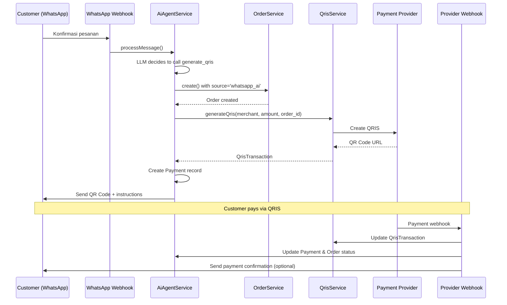

# Design Document: AI Agent QRIS Integration

## Overview

Fitur ini mengintegrasikan AI Agent WhatsApp dengan sistem Order POS dan QRIS yang sudah ada. Integrasi mencakup:

1. **Order Integration** - Order dari AI Agent tercatat di sistem POS dengan source 'whatsapp_ai'
2. **Payment Integration** - Payment record dibuat saat QRIS di-generate dan di-update saat pembayaran selesai
3. **QRIS Generation** - AI Agent memanggil QrisService untuk generate QRIS yang valid
4. **Status Tracking** - Customer dapat cek status pembayaran melalui AI Agent
5. **Test Endpoint** - Dashboard test endpoint mendukung QRIS flow untuk testing

## Architecture



## Components and Interfaces

### 1. AiAgentService Updates

Menambahkan dependency injection untuk QrisService dan method baru untuk QRIS handling.

```php
class AiAgentService
{
    protected QrisService $qrisService;
    
    public function __construct(
        WhatsAppAccountService $whatsappAccountService,
        OrderService $orderService,
        QrisService $qrisService  // NEW
    ) {
        $this->qrisService = $qrisService;
    }
    
    // NEW: Get tool definitions including QRIS tools
    protected function getToolDefinitions(AiAgent $aiAgent): array
    {
        $tools = [/* existing tools */];
        
        if ($aiAgent->isQrisEnabled()) {
            $tools[] = $this->getGenerateQrisTool();
            $tools[] = $this->getCheckPaymentStatusTool();
        }
        
        return $tools;
    }
    
    // NEW: Generate QRIS tool definition
    protected function getGenerateQrisTool(): array;
    
    // NEW: Check payment status tool definition
    protected function getCheckPaymentStatusTool(): array;
    
    // NEW: Execute generate_qris tool
    protected function generateQrisForOrder(
        AiAgentConversation $conversation,
        int $userId,
        ?int $orderId = null
    ): string;
    
    // NEW: Execute check_payment_status tool
    protected function checkPaymentStatus(
        AiAgentConversation $conversation
    ): string;
    
    // UPDATED: confirmAndCreateOrder now creates Payment and QRIS
    protected function confirmAndCreateOrder(
        AiAgentConversation $conversation,
        WhatsAppAccount $account,
        WhatsAppContact $contact
    ): void;
}
```

### 2. AiAgent Model Updates

Menambahkan method untuk QRIS validation dan SubMerchant access.

```php
class AiAgent extends Model
{
    // NEW: Check if QRIS is properly enabled
    public function isQrisEnabled(): bool
    {
        return $this->qris_enabled 
            && $this->hasActiveSubMerchant()
            && $this->hasActivePaymentProvider();
    }
    
    // NEW: Get user's active SubMerchant
    public function getSubMerchant(): ?SubMerchant
    {
        $user = $this->whatsappAccount->user;
        return SubMerchant::where('user_id', $user->id)
            ->where('is_active', true)
            ->first();
    }
    
    // NEW: Check if user has active SubMerchant
    public function hasActiveSubMerchant(): bool
    {
        return $this->getSubMerchant() !== null;
    }
    
    // NEW: Check if user has active payment provider
    public function hasActivePaymentProvider(): bool
    {
        $user = $this->whatsappAccount->user;
        return PaymentProviderCredential::where('user_id', $user->id)
            ->where('is_active', true)
            ->where('connection_status', 'valid')
            ->exists();
    }
}
```

### 3. AiAgentConversation Model Updates

Menambahkan field untuk tracking QRIS transaction.

```php
class AiAgentConversation extends Model
{
    protected $fillable = [
        // existing...
        'current_order_id',        // NEW
        'current_qris_transaction_id',  // NEW
    ];
    
    // NEW: Set current order
    public function setCurrentOrder(int $orderId): void;
    
    // NEW: Get current order
    public function getCurrentOrder(): ?Order;
    
    // NEW: Set current QRIS transaction
    public function setCurrentQrisTransaction(int $transactionId): void;
    
    // NEW: Get current QRIS transaction
    public function getCurrentQrisTransaction(): ?QrisTransaction;
    
    // NEW: Clear payment context
    public function clearPaymentContext(): void;
}
```

### 4. Order Model Updates

Menambahkan source field untuk tracking origin.

```php
class Order extends Model
{
    const SOURCE_POS = 'pos';
    const SOURCE_WHATSAPP_AI = 'whatsapp_ai';
    
    protected $fillable = [
        // existing...
        'source',           // NEW: 'pos' or 'whatsapp_ai'
        'customer_name',    // NEW: from WhatsApp contact
        'customer_phone',   // NEW: from WhatsApp contact
    ];
    
    // NEW: Scope for filtering by source
    public function scopeFromWhatsAppAi($query)
    {
        return $query->where('source', self::SOURCE_WHATSAPP_AI);
    }
    
    public function scopeFromPos($query)
    {
        return $query->where('source', self::SOURCE_POS);
    }
}
```

### 5. QrisTransaction Model Updates

Menambahkan order_id foreign key.

```php
class QrisTransaction extends Model
{
    protected $fillable = [
        // existing...
        'order_id',  // NEW: optional link to Order
    ];
    
    // NEW: Relationship to Order
    public function order(): BelongsTo
    {
        return $this->belongsTo(Order::class);
    }
}
```

### 6. Payment Model (New or Updated)

Model untuk tracking pembayaran.

```php
class Payment extends Model
{
    const METHOD_CASH = 'cash';
    const METHOD_QRIS = 'qris';
    const METHOD_TRANSFER = 'transfer';
    
    const STATUS_PENDING = 'pending';
    const STATUS_PAID = 'paid';
    const STATUS_FAILED = 'failed';
    const STATUS_EXPIRED = 'expired';
    
    protected $fillable = [
        'order_id',
        'qris_transaction_id',
        'method',
        'amount',
        'status',
        'paid_at',
    ];
    
    public function order(): BelongsTo;
    public function qrisTransaction(): BelongsTo;
    
    public function markAsPaid(): void
    {
        $this->status = self::STATUS_PAID;
        $this->paid_at = now();
        $this->save();
        
        // Update linked order
        if ($this->order) {
            $this->order->update(['status' => 'paid']);
        }
    }
}
```

### 7. AiAgentController Updates

Update test endpoint untuk mendukung QRIS tools.

```php
class AiAgentController extends Controller
{
    protected QrisService $qrisService;  // NEW
    
    // UPDATED: test() method includes QRIS tools
    public function test(Request $request): JsonResponse
    {
        // ... existing code ...
        
        // Get tool definitions including QRIS if enabled
        $tools = null;
        if ($aiAgent->isOrderEnabled()) {
            $tools = $this->getTestToolDefinitions($aiAgent);
        }
        
        // ... rest of existing code ...
    }
    
    // NEW: Get tool definitions for test endpoint
    protected function getTestToolDefinitions(AiAgent $aiAgent): array
    {
        $tools = [/* existing tools */];
        
        if ($aiAgent->isQrisEnabled()) {
            $tools[] = [
                'type' => 'function',
                'function' => [
                    'name' => 'generate_qris',
                    'description' => 'Generate QRIS payment code untuk pesanan',
                    'parameters' => [
                        'type' => 'object',
                        'properties' => [
                            'amount' => [
                                'type' => 'number',
                                'description' => 'Jumlah pembayaran dalam Rupiah',
                            ],
                            'description' => [
                                'type' => 'string',
                                'description' => 'Deskripsi pembayaran',
                            ],
                        ],
                        'required' => ['amount'],
                    ],
                ],
            ];
            
            $tools[] = [
                'type' => 'function',
                'function' => [
                    'name' => 'check_payment_status',
                    'description' => 'Cek status pembayaran QRIS terakhir',
                    'parameters' => [
                        'type' => 'object',
                        'properties' => [],
                    ],
                ],
            ];
        }
        
        return $tools;
    }
    
    // NEW: Execute test tool calls including QRIS
    protected function executeTestToolCall(
        string $functionName, 
        array $arguments, 
        int $userId,
        AiAgentConversation $conversation
    ): string;
    
    // NEW: Toggle QRIS with validation
    public function toggleQris(Request $request): JsonResponse;
}
```

## Data Models

### Database Migration: Add order_id to qris_transactions

```php
Schema::table('qris_transactions', function (Blueprint $table) {
    $table->foreignId('order_id')->nullable()->constrained()->nullOnDelete();
});
```

### Database Migration: Add source to orders

```php
Schema::table('orders', function (Blueprint $table) {
    $table->string('source')->default('pos');
    $table->string('customer_name')->nullable();
    $table->string('customer_phone')->nullable();
    $table->index('source');
});
```

### Database Migration: Add payment context to ai_agent_conversations

```php
Schema::table('ai_agent_conversations', function (Blueprint $table) {
    $table->foreignId('current_order_id')->nullable()->constrained('orders')->nullOnDelete();
    $table->foreignId('current_qris_transaction_id')->nullable()->constrained('qris_transactions')->nullOnDelete();
});
```

### Database Migration: Create payments table (if not exists)

```php
Schema::create('payments', function (Blueprint $table) {
    $table->id();
    $table->foreignId('order_id')->constrained()->cascadeOnDelete();
    $table->foreignId('qris_transaction_id')->nullable()->constrained()->nullOnDelete();
    $table->string('method'); // cash, qris, transfer
    $table->decimal('amount', 15, 2);
    $table->string('status')->default('pending');
    $table->timestamp('paid_at')->nullable();
    $table->timestamps();
    
    $table->index(['order_id', 'status']);
});
```

## Correctness Properties

*A property is a characteristic or behavior that should hold true across all valid executions of a system-essentially, a formal statement about what the system should do. Properties serve as the bridge between human-readable specifications and machine-verifiable correctness guarantees.*

### Property 1: Order Creation Integrity

*For any* order created by AI Agent, the order SHALL have source='whatsapp_ai', a valid store_id from AI Agent's default_store_id, and customer information from the WhatsApp contact.

**Validates: Requirements 1.1, 1.2, 1.3**

### Property 2: Payment-Order Linkage

*For any* QRIS generated by AI Agent for an order, a Payment record SHALL be created with order_id set, method='qris', status='pending', and the correct amount.

**Validates: Requirements 2.1, 2.2**

### Property 3: QRIS-Order Linkage

*For any* QRIS generated by AI Agent for an order, the QrisTransaction SHALL have order_id set to the associated Order's id.

**Validates: Requirements 4.2**

### Property 4: QRIS Tool Availability

*For any* AI Agent with qris_enabled=true AND active SubMerchant AND active payment provider, the tool definitions SHALL include 'generate_qris' and 'check_payment_status' tools.

**Validates: Requirements 3.1, 7.1**

### Property 5: QRIS Generation Creates Valid Transaction

*For any* call to generate_qris tool with valid amount, the system SHALL create a QrisTransaction with valid qr_code_url and the QrisTransaction SHALL be linked to the Order.

**Validates: Requirements 3.2, 3.3, 6.1**

### Property 6: Payment Status Response Correctness

*For any* call to check_payment_status tool, the response SHALL correctly reflect the QrisTransaction status: 'paid' returns confirmation, 'pending' returns processing message, 'expired' offers regeneration.

**Validates: Requirements 7.3, 7.4, 7.5**

### Property 7: QRIS Enable Validation

*For any* attempt to enable qris_enabled on AI Agent, the system SHALL validate that both active SubMerchant and active payment provider credentials exist, and SHALL return descriptive error if validation fails.

**Validates: Requirements 8.1, 8.2, 8.3, 8.4**

### Property 8: Webhook Cascading Updates

*For any* successful payment webhook, the system SHALL update QrisTransaction status to 'paid', Payment status to 'paid', and Order status to 'paid' in sequence.

**Validates: Requirements 10.1, 10.2, 2.3, 2.4**

### Property 9: QRIS Message Format

*For any* QRIS message sent to customer, the message SHALL contain: order summary, total amount in Rp format, QR code URL, and expiry time in Bahasa Indonesia.

**Validates: Requirements 9.1, 9.2, 9.3**

### Property 10: Test Endpoint Consistency

*For any* QRIS generated via test endpoint, the system SHALL create real QrisTransaction and Payment records using the same services as production, and the response SHALL include the QR code URL.

**Validates: Requirements 11.1, 11.2, 11.3, 11.4, 11.5, 11.6**

## Error Handling

### QRIS Generation Errors

| Error Condition | User Message | Log Level |
|----------------|--------------|-----------|
| No active SubMerchant | "Maaf, pembayaran QRIS belum tersedia. Silakan hubungi penjual." | WARNING |
| No active payment provider | "Maaf, pembayaran QRIS sedang tidak tersedia. Silakan coba lagi nanti." | WARNING |
| Provider API error | "Maaf, terjadi kesalahan saat membuat kode pembayaran. Silakan coba lagi." | ERROR |
| Invalid amount | "Maaf, jumlah pembayaran tidak valid." | WARNING |

### Payment Status Check Errors

| Error Condition | User Message | Log Level |
|----------------|--------------|-----------|
| No pending transaction | "Tidak ada pembayaran yang sedang diproses." | INFO |
| Transaction not found | "Maaf, data pembayaran tidak ditemukan." | WARNING |

## Testing Strategy

### Unit Tests

1. **AiAgent::isQrisEnabled()** - Test various combinations of qris_enabled, SubMerchant, and provider status
2. **AiAgentService::generateQrisForOrder()** - Test QRIS generation with mocked QrisService
3. **AiAgentService::checkPaymentStatus()** - Test status responses for different transaction states
4. **Payment::markAsPaid()** - Test cascading status updates

### Property-Based Tests

Using PHPUnit with data providers for property testing:

1. **Order Creation Property Test** - Generate random orders via AI Agent, verify all have correct source and store_id
2. **Payment Linkage Property Test** - Generate QRIS for orders, verify Payment records are created correctly
3. **Status Response Property Test** - Test all status combinations return correct response type

### Integration Tests

1. **Full QRIS Flow Test** - Test complete flow from order confirmation to QRIS generation
2. **Webhook Processing Test** - Test webhook updates cascade correctly
3. **Test Endpoint QRIS Test** - Test dashboard test endpoint generates real QRIS
