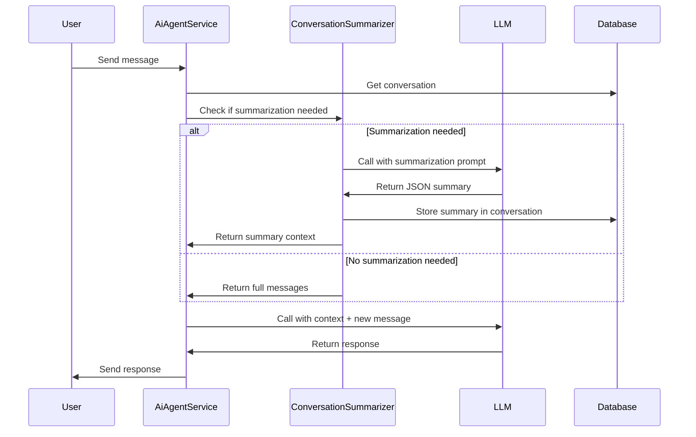
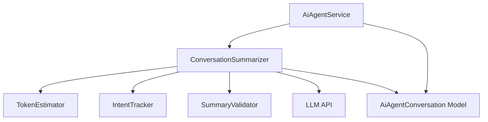

# Design Document: Conversation Summarization

## Overview

Conversation Summarization adalah fitur yang meringkas percakapan panjang antara user dan AI Agent menjadi konteks terstruktur dalam format JSON. Fitur ini mengoptimalkan penggunaan token LLM dengan mengganti history percakapan panjang dengan ringkasan singkat yang tetap mempertahankan konteks penting.

Sistem akan secara otomatis mendeteksi kapan summarization diperlukan (berdasarkan jumlah pesan, estimasi token, atau perubahan intent), memanggil LLM dengan prompt khusus untuk summarization, dan menyimpan hasilnya untuk digunakan dalam LLM call berikutnya.

## Architecture

### High-Level Flow



### Component Architecture



## Components and Interfaces

### 1. ConversationSummarizer Class

Service utama yang menangani summarization logic.

```php
class ConversationSummarizer
{
    /**
     * Check if conversation needs summarization.
     */
    public function shouldSummarize(AiAgentConversation $conversation): bool;
    
    /**
     * Generate summary from conversation messages.
     */
    public function generateSummary(array $messages): ?array;
    
    /**
     * Get context for LLM call (either summary or full messages).
     */
    public function getContextForLLM(AiAgentConversation $conversation): array;
    
    /**
     * Store summary in conversation.
     */
    public function storeSummary(AiAgentConversation $conversation, array $summary): void;
    
    /**
     * Clear summary from conversation.
     */
    public function clearSummary(AiAgentConversation $conversation): void;
}
```

### 2. TokenEstimator Class

Utility untuk estimasi token count.

```php
class TokenEstimator
{
    /**
     * Estimate token count for text.
     * Uses approximation: 1 token ≈ 2 chars for Indonesian, 4 chars for English.
     */
    public function estimateTokens(string $text, string $language = 'id'): int;
    
    /**
     * Estimate total tokens for conversation messages.
     */
    public function estimateConversationTokens(array $messages): int;
    
    /**
     * Check if token threshold is exceeded.
     */
    public function exceedsThreshold(array $messages, int $threshold = 800): bool;
}
```

### 3. IntentTracker Class

Tracker untuk mendeteksi perubahan intent user.

```php
class IntentTracker
{
    /**
     * Get current intent from conversation context.
     */
    public function getCurrentIntent(AiAgentConversation $conversation): ?string;
    
    /**
     * Check if intent has changed.
     */
    public function hasIntentChanged(AiAgentConversation $conversation, string $newIntent): bool;
    
    /**
     * Update intent in conversation context.
     */
    public function updateIntent(AiAgentConversation $conversation, string $intent): void;
}
```

### 4. SummaryValidator Class

Validator untuk memastikan format summary benar.

```php
class SummaryValidator
{
    /**
     * Validate summary structure and required fields.
     */
    public function validate(array $summary): bool;
    
    /**
     * Get validation errors.
     */
    public function getErrors(): array;
    
    /**
     * Check if summary has required fields.
     */
    public function hasRequiredFields(array $summary): bool;
}
```

### 5. AiAgentConversation Model Extensions

Tambahan methods untuk mendukung summarization.

```php
// Add to AiAgentConversation model

/**
 * Get conversation summary from context.
 */
public function getSummary(): ?array;

/**
 * Set conversation summary in context.
 */
public function setSummary(array $summary): void;

/**
 * Check if conversation has summary.
 */
public function hasSummary(): bool;

/**
 * Clear summary from context.
 */
public function clearSummary(): void;

/**
 * Get message count.
 */
public function getMessageCount(): int;

/**
 * Get recent messages (last N messages).
 */
public function getRecentMessages(int $count = 3): array;
```

## Data Models

### Summary JSON Structure

```json
{
  "summary": "Ringkasan singkat 1-2 kalimat",
  "intent": "browse_menu | order_food | reservation | payment | general_question | unknown",
  "key_data": {
    "products": ["produk1", "produk2"],
    "reservation_date": "2024-01-15",
    "reservation_time": "19:00",
    "people_count": 4,
    "order_items": [
      {
        "product": "Ayam Goreng",
        "quantity": 2,
        "price": 25000
      }
    ],
    "total_estimate": 50000
  },
  "missing_information": ["reservation_date", "payment_method"],
  "generated_at": "2024-01-15T10:30:00Z"
}
```

### Conversation Context Structure (Updated)

```json
{
  "cart": [...],
  "pending_order": {...},
  "summary": {
    "summary": "...",
    "intent": "...",
    "key_data": {...},
    "missing_information": [...],
    "generated_at": "..."
  },
  "last_intent": "order_food",
  "summarized_at": "2024-01-15T10:30:00Z"
}
```

### Summarization System Prompt

```
Kamu adalah modul peringkas percakapan (conversation summarizer).

Tugas kamu:
- Meringkas percakapan user dan bot menjadi informasi inti saja
- Fokus pada tujuan user dan status terkini
- HANYA gunakan informasi yang eksplisit disebutkan
- JANGAN menambahkan asumsi atau interpretasi
- JANGAN menulis ulang percakapan
- JANGAN memberi saran atau jawaban

Ambil dan ringkas hal-hal berikut jika ada:
- Tujuan utama user
- Produk / menu yang diminati
- Data penting (tanggal, jam, jumlah orang, jumlah item)
- Status proses (masih tanya, sudah pilih, menunggu pembayaran, selesai)
- Informasi penting lain yang mempengaruhi langkah berikutnya

Jika informasi belum lengkap, tulis apa yang masih kurang.

Gunakan format JSON persis seperti di bawah. Jangan menambahkan teks di luar JSON.

{
  "summary": "Ringkasan singkat 1–2 kalimat.",
  "intent": "browse_menu | order_food | reservation | payment | general_question | unknown",
  "key_data": {
    "products": [],
    "reservation_date": null,
    "reservation_time": null,
    "people_count": null,
    "order_items": [],
    "total_estimate": null
  },
  "missing_information": []
}
```

## Correctness Properties

*A property is a characteristic or behavior that should hold true across all valid executions of a system—essentially, a formal statement about what the system should do. Properties serve as the bridge between human-readable specifications and machine-verifiable correctness guarantees.*

### Property 1: Summarization Trigger Consistency

*For any* conversation with 6 or more messages, calling `shouldSummarize()` should return true.

**Validates: Requirements 1.1**

### Property 2: Token Threshold Detection

*For any* conversation where estimated tokens exceed 800, calling `shouldSummarize()` should return true.

**Validates: Requirements 1.2**

### Property 3: Short Message Exclusion

*For any* conversation where the last message is a short confirmation (length ≤ 3 characters and matches "ok", "ya", "iya"), calling `shouldSummarize()` should return false.

**Validates: Requirements 1.4**

### Property 4: Summary JSON Validity

*For any* valid conversation messages, the generated summary should be valid JSON that can be parsed without errors.

**Validates: Requirements 2.2, 6.1**

### Property 5: Summary Required Fields

*For any* generated summary, it should contain all required fields: summary, intent, key_data, and missing_information.

**Validates: Requirements 2.2, 6.4**

### Property 6: Summary Serialization Round-Trip

*For any* valid Summary_Context object, serializing to JSON then deserializing should produce an equivalent object with all fields preserved.

**Validates: Requirements 8.1**

### Property 7: Product Extraction Accuracy

*For any* conversation that explicitly mentions product names, the generated summary's key_data.products array should contain those product names.

**Validates: Requirements 2.5**

### Property 8: Intent Classification Validity

*For any* generated summary, the intent field should be one of the valid values: browse_menu, order_food, reservation, payment, general_question, or unknown.

**Validates: Requirements 4.1**

### Property 9: Token Estimation Consistency

*For any* text string, estimating tokens twice should return the same value.

**Validates: Requirements 5.1**

### Property 10: Context Fallback Safety

*For any* conversation where summarization fails, calling `getContextForLLM()` should return the original message history without throwing errors.

**Validates: Requirements 7.4**

## Error Handling

### Summarization Failures

1. **LLM API Failure**: Jika LLM API gagal, fallback ke message history asli
2. **Invalid JSON Response**: Retry sekali dengan prompt lebih strict, jika gagal lagi fallback ke message history
3. **Missing Required Fields**: Log warning dan fallback ke message history
4. **Token Estimation Error**: Gunakan fallback threshold berdasarkan message count

### Validation Errors

1. **Invalid Summary Structure**: Reject dan fallback ke message history
2. **Invalid Intent Value**: Set intent ke "unknown" dan lanjutkan
3. **Malformed Key Data**: Log warning, gunakan empty object untuk key_data

### Storage Errors

1. **Database Write Failure**: Log error, lanjutkan tanpa menyimpan summary (akan di-generate ulang next time)
2. **Serialization Error**: Log error dengan detail, fallback ke message history

## Testing Strategy

### Unit Tests

1. **TokenEstimator Tests**
   - Test estimasi token untuk berbagai panjang text
   - Test estimasi untuk bahasa Indonesia vs English
   - Test threshold checking

2. **IntentTracker Tests**
   - Test deteksi perubahan intent
   - Test penyimpanan dan retrieval intent
   - Test handling missing intent

3. **SummaryValidator Tests**
   - Test validasi struktur JSON
   - Test validasi required fields
   - Test handling invalid data

4. **ConversationSummarizer Tests**
   - Test shouldSummarize logic untuk berbagai kondisi
   - Test generateSummary dengan mock LLM responses
   - Test getContextForLLM dengan dan tanpa summary
   - Test error handling dan fallback

### Property-Based Tests

Setiap property test harus run minimum 100 iterations dan di-tag dengan format:
**Feature: conversation-summarization, Property {number}: {property_text}**

1. **Property 1 Test**: Generate random conversations dengan ≥6 messages, verify shouldSummarize returns true
2. **Property 2 Test**: Generate random conversations dengan high token count, verify shouldSummarize returns true
3. **Property 3 Test**: Generate conversations ending with short confirmations, verify shouldSummarize returns false
4. **Property 4 Test**: Generate random valid summaries, verify JSON parsing succeeds
5. **Property 5 Test**: Generate random summaries, verify all required fields present
6. **Property 6 Test**: Generate random summary objects, verify round-trip serialization preserves data
7. **Property 7 Test**: Generate conversations with explicit product mentions, verify products extracted
8. **Property 8 Test**: Generate random summaries, verify intent is valid enum value
9. **Property 9 Test**: Generate random text strings, verify token estimation is consistent
10. **Property 10 Test**: Simulate summarization failures, verify fallback returns valid message history

### Integration Tests

1. Test full flow dari message → summarization → LLM call dengan summary context
2. Test intent change detection across multiple messages
3. Test summary storage dan retrieval dari database
4. Test backward compatibility dengan conversations tanpa summary

### Manual Testing Scenarios

1. Percakapan panjang (>10 messages) tentang order makanan
2. Percakapan dengan perubahan intent (browse → order → payment)
3. Percakapan dengan informasi incomplete (missing reservation date)
4. Percakapan dengan special characters dan emoji
5. Percakapan dalam bahasa Indonesia dan English mixed
