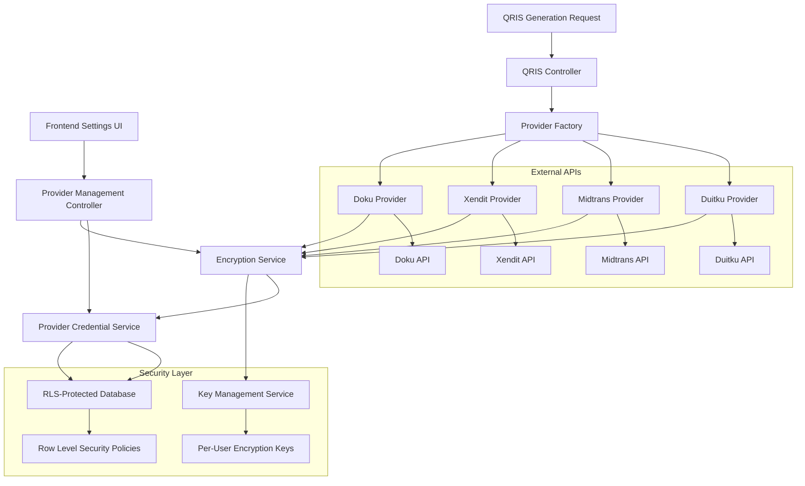

# Design Document: Multi-Provider QRIS with BYOK

## Overview

The Multi-Provider QRIS BYOK system enables users to securely configure their own payment provider credentials (Doku, Xendit, Midtrans, Duitku) with end-to-end AES-256 encryption and Row Level Security. This design replaces the platform-managed Midtrans integration with a user-managed multi-provider approach, giving users full control over their payment processing while maintaining security through encryption and database-level access controls.

## Architecture

### System Components



### Technology Stack

- **Backend**: Laravel 11 with PHP 8.2+
- **Database**: PostgreSQL 14+ (for RLS support) or MySQL 8+ with application-level filtering
- **Encryption**: Laravel Encrypter with AES-256-CBC
- **Key Management**: Secure key derivation per user
- **Authentication**: Laravel Sanctum for API security
- **Frontend**: Blade templates with Alpine.js for reactive UI
- **HTTP Client**: Guzzle for provider API calls

## Components and Interfaces

### 1. Provider Credential Management

#### PaymentProviderCredential Model
```php
class PaymentProviderCredential extends Model
{
    protected $fillable = [
        'user_id', 'provider', 'credentials_encrypted', 
        'is_active', 'connection_status', 'last_validated_at',
        'validation_error'
    ];
    
    protected $casts = [
        'last_validated_at' => 'datetime',
        'is_active' => 'boolean'
    ];
    
    // Providers enum
    const PROVIDER_DOKU = 'doku';
    const PROVIDER_XENDIT = 'xendit';
    const PROVIDER_MIDTRANS = 'midtrans';
    const PROVIDER_DUITKU = 'duitku';
    
    public function user(): BelongsTo;
    public function isValid(): bool;
    public function needsRevalidation(): bool;
}
```

#### ProviderCredentialService
```php
class ProviderCredentialService
{
    public function __construct(
        private EncryptionService $encryption,
        private ProviderValidationService $validation
    ) {}
    
    public function storeCredentials(
        User $user, 
        string $provider, 
        array $credentials
    ): PaymentProviderCredential;
    
    public function updateCredentials(
        PaymentProviderCredential $credential,
        array $newCredentials
    ): bool;
    
    public function deleteCredentials(PaymentProviderCredential $credential): bool;
    
    public function setActiveProvider(User $user, string $provider): bool;
    
    public function getActiveProvider(User $user): ?PaymentProviderCredential;
    
    public function validateCredentials(
        PaymentProviderCredential $credential
    ): ValidationResult;
}
```

### 2. Encryption System

#### EncryptionService
```php
class EncryptionService
{
    public function __construct(
        private KeyManagementService $keyManager
    ) {}
    
    public function encryptCredentials(User $user, array $credentials): string;
    
    public function decryptCredentials(
        User $user, 
        string $encryptedData
    ): array;
    
    public function rotateUserKey(User $user): bool;
    
    private function deriveUserKey(User $user): string;
    
    private function generateIV(): string;
}
```

#### KeyManagementService
```php
class KeyManagementService
{
    public function getUserEncryptionKey(User $user): string;
    
    public function generateUserKey(User $user): string;
    
    public function storeUserKey(User $user, string $key): bool;
    
    public function rotateKey(User $user): string;
    
    private function deriveKeyFromUserSecret(User $user): string;
}
```

### 3. Provider Abstraction Layer

#### PaymentProviderInterface
```php
interface PaymentProviderInterface
{
    public function validateCredentials(array $credentials): ValidationResult;
    
    public function generateQris(array $credentials, QrisRequest $request): QrisResponse;
    
    public function checkTransactionStatus(
        array $credentials, 
        string $transactionId
    ): TransactionStatus;
    
    public function getProviderName(): string;
    
    public function getRequiredCredentialFields(): array;
}
```

#### Provider Implementations

**DokuProvider**
```php
class DokuProvider implements PaymentProviderInterface
{
    public function getRequiredCredentialFields(): array
    {
        return ['client_id', 'secret_key'];
    }
    
    public function validateCredentials(array $credentials): ValidationResult
    {
        // Test API call to Doku SNAP API
        // Endpoint: POST /snap/v1/access-token/b2b
    }
    
    public function generateQris(array $credentials, QrisRequest $request): QrisResponse
    {
        // Call Doku QRIS API
        // Endpoint: POST /snap/v1/qr/qr-mpm-generate
    }
}
```

**XenditProvider**
```php
class XenditProvider implements PaymentProviderInterface
{
    public function getRequiredCredentialFields(): array
    {
        return ['api_key', 'callback_token'];
    }
    
    public function validateCredentials(array $credentials): ValidationResult
    {
        // Test API call to Xendit
        // Endpoint: GET /balance
    }
    
    public function generateQris(array $credentials, QrisRequest $request): QrisResponse
    {
        // Call Xendit QR Code API
        // Endpoint: POST /qr_codes
    }
}
```

**MidtransProvider**
```php
class MidtransProvider implements PaymentProviderInterface
{
    public function getRequiredCredentialFields(): array
    {
        return ['server_key', 'client_key'];
    }
    
    public function validateCredentials(array $credentials): ValidationResult
    {
        // Test API call to Midtrans
        // Endpoint: GET /v2/transactions/{order_id}/status
    }
    
    public function generateQris(array $credentials, QrisRequest $request): QrisResponse
    {
        // Call Midtrans QRIS API
        // Endpoint: POST /v2/charge
    }
}
```

**DuitkuProvider**
```php
class DuitkuProvider implements PaymentProviderInterface
{
    public function getRequiredCredentialFields(): array
    {
        return ['merchant_code', 'api_key'];
    }
    
    public function validateCredentials(array $credentials): ValidationResult
    {
        // Test API call to Duitku
        // Endpoint: POST /webapi/api/merchant/inquiry
    }
    
    public function generateQris(array $credentials, QrisRequest $request): QrisResponse
    {
        // Call Duitku QRIS API
        // Endpoint: POST /webapi/api/merchant/createinvoice
    }
}
```

#### ProviderFactory
```php
class ProviderFactory
{
    public function make(string $provider): PaymentProviderInterface
    {
        return match($provider) {
            'doku' => app(DokuProvider::class),
            'xendit' => app(XenditProvider::class),
            'midtrans' => app(MidtransProvider::class),
            'duitku' => app(DuitkuProvider::class),
            default => throw new UnsupportedProviderException($provider)
        };
    }
}
```

### 4. Row Level Security Implementation

#### Database Schema with RLS (PostgreSQL)

```sql
-- Enable RLS on credentials table
CREATE TABLE payment_provider_credentials (
    id BIGSERIAL PRIMARY KEY,
    user_id BIGINT NOT NULL REFERENCES users(id) ON DELETE CASCADE,
    provider VARCHAR(20) NOT NULL CHECK (provider IN ('doku', 'xendit', 'midtrans', 'duitku')),
    credentials_encrypted TEXT NOT NULL,
    is_active BOOLEAN DEFAULT false,
    connection_status VARCHAR(20) DEFAULT 'pending',
    validation_error TEXT NULL,
    last_validated_at TIMESTAMP NULL,
    created_at TIMESTAMP DEFAULT CURRENT_TIMESTAMP,
    updated_at TIMESTAMP DEFAULT CURRENT_TIMESTAMP,
    
    UNIQUE(user_id, provider),
    INDEX idx_user_active (user_id, is_active),
    INDEX idx_provider_status (provider, connection_status)
);

-- Enable Row Level Security
ALTER TABLE payment_provider_credentials ENABLE ROW LEVEL SECURITY;

-- Policy: Users can only see their own credentials
CREATE POLICY user_credentials_select ON payment_provider_credentials
    FOR SELECT
    USING (user_id = current_setting('app.current_user_id')::BIGINT);

-- Policy: Users can only insert their own credentials
CREATE POLICY user_credentials_insert ON payment_provider_credentials
    FOR INSERT
    WITH CHECK (user_id = current_setting('app.current_user_id')::BIGINT);

-- Policy: Users can only update their own credentials
CREATE POLICY user_credentials_update ON payment_provider_credentials
    FOR UPDATE
    USING (user_id = current_setting('app.current_user_id')::BIGINT);

-- Policy: Users can only delete their own credentials
CREATE POLICY user_credentials_delete ON payment_provider_credentials
    FOR DELETE
    USING (user_id = current_setting('app.current_user_id')::BIGINT);
```

#### User Encryption Keys Table
```sql
CREATE TABLE user_encryption_keys (
    id BIGSERIAL PRIMARY KEY,
    user_id BIGINT NOT NULL UNIQUE REFERENCES users(id) ON DELETE CASCADE,
    encryption_key_encrypted TEXT NOT NULL,
    key_version INT DEFAULT 1,
    created_at TIMESTAMP DEFAULT CURRENT_TIMESTAMP,
    updated_at TIMESTAMP DEFAULT CURRENT_TIMESTAMP
);

-- Enable RLS
ALTER TABLE user_encryption_keys ENABLE ROW LEVEL SECURITY;

-- Policy: Users can only access their own encryption key
CREATE POLICY user_keys_access ON user_encryption_keys
    FOR ALL
    USING (user_id = current_setting('app.current_user_id')::BIGINT);
```

#### RLS Middleware for Laravel
```php
class SetPostgresUserContext
{
    public function handle(Request $request, Closure $next)
    {
        if ($user = $request->user()) {
            DB::statement("SET app.current_user_id = ?", [$user->id]);
        }
        
        return $next($request);
    }
    
    public function terminate($request, $response)
    {
        // Reset after request
        DB::statement("RESET app.current_user_id");
    }
}
```

### 5. QRIS Generation with Multi-Provider Support

#### QrisGenerationService
```php
class QrisGenerationService
{
    public function __construct(
        private ProviderCredentialService $credentialService,
        private EncryptionService $encryption,
        private ProviderFactory $providerFactory
    ) {}
    
    public function generateQris(User $user, QrisRequest $request): QrisResponse
    {
        // Get active provider
        $credential = $this->credentialService->getActiveProvider($user);
        
        if (!$credential) {
            throw new NoActiveProviderException();
        }
        
        // Decrypt credentials
        $decryptedCredentials = $this->encryption->decryptCredentials(
            $user, 
            $credential->credentials_encrypted
        );
        
        // Get provider implementation
        $provider = $this->providerFactory->make($credential->provider);
        
        // Generate QRIS
        $response = $provider->generateQris($decryptedCredentials, $request);
        
        // Store transaction record
        $this->storeTransaction($user, $credential, $request, $response);
        
        return $response;
    }
    
    private function storeTransaction(
        User $user,
        PaymentProviderCredential $credential,
        QrisRequest $request,
        QrisResponse $response
    ): void {
        // Store in qris_transactions table with provider info
    }
}
```

## Data Models

### Database Schema

#### payment_provider_credentials Table
```sql
CREATE TABLE payment_provider_credentials (
    id BIGINT PRIMARY KEY AUTO_INCREMENT,
    user_id BIGINT NOT NULL,
    provider ENUM('doku', 'xendit', 'midtrans', 'duitku') NOT NULL,
    credentials_encrypted TEXT NOT NULL,
    is_active BOOLEAN DEFAULT false,
    connection_status ENUM('pending', 'valid', 'invalid') DEFAULT 'pending',
    validation_error TEXT NULL,
    last_validated_at TIMESTAMP NULL,
    created_at TIMESTAMP DEFAULT CURRENT_TIMESTAMP,
    updated_at TIMESTAMP DEFAULT CURRENT_TIMESTAMP ON UPDATE CURRENT_TIMESTAMP,
    
    FOREIGN KEY (user_id) REFERENCES users(id) ON DELETE CASCADE,
    UNIQUE KEY unique_user_provider (user_id, provider),
    INDEX idx_user_active (user_id, is_active),
    INDEX idx_provider_status (provider, connection_status)
);
```

#### user_encryption_keys Table
```sql
CREATE TABLE user_encryption_keys (
    id BIGINT PRIMARY KEY AUTO_INCREMENT,
    user_id BIGINT NOT NULL UNIQUE,
    encryption_key_encrypted TEXT NOT NULL,
    key_version INT DEFAULT 1,
    created_at TIMESTAMP DEFAULT CURRENT_TIMESTAMP,
    updated_at TIMESTAMP DEFAULT CURRENT_TIMESTAMP ON UPDATE CURRENT_TIMESTAMP,
    
    FOREIGN KEY (user_id) REFERENCES users(id) ON DELETE CASCADE
);
```

#### credential_access_logs Table (Audit)
```sql
CREATE TABLE credential_access_logs (
    id BIGINT PRIMARY KEY AUTO_INCREMENT,
    user_id BIGINT NOT NULL,
    credential_id BIGINT NOT NULL,
    action ENUM('create', 'read', 'update', 'delete', 'decrypt') NOT NULL,
    ip_address VARCHAR(45),
    user_agent TEXT,
    success BOOLEAN DEFAULT true,
    error_message TEXT NULL,
    created_at TIMESTAMP DEFAULT CURRENT_TIMESTAMP,
    
    FOREIGN KEY (user_id) REFERENCES users(id) ON DELETE CASCADE,
    FOREIGN KEY (credential_id) REFERENCES payment_provider_credentials(id) ON DELETE CASCADE,
    INDEX idx_user_action (user_id, action, created_at),
    INDEX idx_credential_access (credential_id, created_at)
);
```

#### Updated qris_transactions Table
```sql
ALTER TABLE qris_transactions 
ADD COLUMN provider VARCHAR(20) AFTER sub_merchant_id,
ADD COLUMN provider_transaction_id VARCHAR(100) AFTER midtrans_transaction_id,
ADD INDEX idx_provider_transactions (provider, status, created_at);
```

## Correctness Properties

*A property is a characteristic or behavior that should hold true across all valid executions of a system-essentially, a formal statement about what the system should do. Properties serve as the bridge between human-readable specifications and machine-verifiable correctness guarantees.*


### Property Reflection

After analyzing all acceptance criteria, I identified several areas where properties can be consolidated:

- **Provider Field Validation (1.2-1.5)**: All four properties test the same concept (required fields per provider) and can be combined into one comprehensive property
- **Encryption Properties (2.1, 2.3, 2.5)**: These all relate to encryption correctness and can be unified
- **RLS Access Control (3.2, 3.4)**: Both test user isolation and can be combined
- **Active Provider Management (4.1, 4.3)**: Both relate to active provider state and can be unified
- **Validation Status Updates (5.5, 5.6)**: Both test status updates after validation and can be combined
- **Provider API Usage (4.4, 7.1)**: These are duplicate properties about using the active provider
- **Error Message Handling (5.3, 7.5, 12.1)**: All three test provider error message propagation
- **Audit Logging (6.5, 10.1, 10.2, 10.3, 10.4)**: All relate to audit logging and can be consolidated

### Core Properties

**Property 1: Provider-Specific Required Fields**
*For any* payment provider configuration (Doku, Xendit, Midtrans, Duitku), the system should validate that all provider-specific required fields are present and reject configurations with missing fields
**Validates: Requirements 1.2, 1.3, 1.4, 1.5**

**Property 2: Multi-Provider Simultaneous Configuration**
*For any* user, the system should allow storing credentials for all four providers simultaneously without conflicts
**Validates: Requirements 1.6**

**Property 3: Provider Type and Credential Persistence**
*For any* stored provider credential, retrieving it should return both the provider type and the encrypted credential data
**Validates: Requirements 1.7**

**Property 4: AES-256 Encryption Enforcement**
*For any* credential submission, the system should encrypt the data using AES-256-CBC or AES-256-GCM before storage and never store credentials in plaintext
**Validates: Requirements 2.1, 2.3, 2.5**

**Property 5: Per-User Encryption Key Uniqueness**
*For any* two different users, their encryption keys should be unique and not shared
**Validates: Requirements 2.2**

**Property 6: Encryption Failure Rejection**
*For any* credential submission where encryption fails, the system should reject the submission and not store any data
**Validates: Requirements 2.6**

**Property 7: Encryption Key Separation**
*For any* user, their encryption key should be stored separately from their encrypted credentials in a different table
**Validates: Requirements 2.7, 6.2**

**Property 8: Row Level Security User Isolation**
*For any* user querying credentials, the system should only return credentials belonging to that user and prevent access to other users' credentials
**Validates: Requirements 3.2, 3.4**

**Property 9: Automatic User Association on Insert**
*For any* credential insertion, the system should automatically associate the credential with the currently authenticated user
**Validates: Requirements 3.3**

**Property 10: RLS Violation Rejection and Logging**
*For any* attempt to access another user's credentials, the system should reject the query and log the violation attempt
**Validates: Requirements 3.5, 10.4**

**Property 11: Single Active Provider Constraint**
*For any* user at any given time, at most one payment provider should be marked as active
**Validates: Requirements 4.1, 4.3**

**Property 12: Active Provider Validation Requirement**
*For any* attempt to activate a provider, the system should validate that credentials exist for that provider before allowing activation
**Validates: Requirements 4.2**

**Property 13: Active Provider Usage for QRIS**
*For any* QRIS generation request, the system should use the user's currently active provider for the API call
**Validates: Requirements 4.4, 7.1**

**Property 14: No Active Provider Prevention**
*For any* QRIS generation request when no provider is active, the system should reject the request and return an error
**Validates: Requirements 4.5**

**Property 15: Credential Validation on Save**
*For any* credential save operation, the system should trigger validation by making a test API call to the provider
**Validates: Requirements 5.1**

**Property 16: Connection Status Update After Validation**
*For any* credential validation attempt, the system should update the connection status to "valid" on success or "invalid" on failure
**Validates: Requirements 5.2, 5.5, 5.6**

**Property 17: Provider Error Message Capture**
*For any* failed validation or QRIS generation, the system should capture and store provider-specific error messages
**Validates: Requirements 5.3, 7.5, 12.1**

**Property 18: Manual Revalidation Capability**
*For any* existing credential, the system should allow triggering revalidation which updates the connection status
**Validates: Requirements 5.4**

**Property 19: Comprehensive Audit Logging**
*For any* credential operation (create, read, update, delete, decrypt, validation), the system should log the event with timestamp, user, and action details
**Validates: Requirements 6.5, 10.1, 10.2, 10.3**

**Property 20: Provider-Specific Request Formatting**
*For any* provider API call, the system should format the request according to that provider's specific API requirements
**Validates: Requirements 7.3**

**Property 21: Provider Response Parsing**
*For any* provider API response, the system should correctly parse the provider-specific format and extract QR code data
**Validates: Requirements 7.4**

**Property 22: Credential Update with Consistent Key**
*For any* credential update, the system should re-encrypt the new credentials using the same user encryption key
**Validates: Requirements 8.1, 8.2**

**Property 23: Credential Deletion and Secure Wipe**
*For any* credential deletion, the system should remove the encrypted data such that it cannot be retrieved
**Validates: Requirements 8.3, 8.5**

**Property 24: Encryption Error Sanitization**
*For any* encryption failure, the system should notify the user without exposing technical implementation details
**Validates: Requirements 12.2**

**Property 25: Error Type Classification**
*For any* validation failure, the system should distinguish between network errors, credential errors, and other error types
**Validates: Requirements 12.3**

**Property 26: RLS Violation Error Sanitization**
*For any* RLS policy violation, the system should display a generic security error without exposing query or user details
**Validates: Requirements 12.5**

## Error Handling

### Encryption Errors
- **Key Generation Failure**: Retry with exponential backoff, log error, notify administrators
- **Encryption Failure**: Reject credential submission, return user-friendly error, log technical details
- **Decryption Failure**: Attempt with previous keys if available, otherwise fail gracefully
- **Key Rotation Errors**: Maintain old key temporarily, allow rollback if needed

### Provider API Errors
- **Invalid Credentials**: Update connection status to invalid, store error message, notify user
- **Network Timeouts**: Distinguish from credential errors, implement retry logic with backoff
- **Rate Limiting**: Implement exponential backoff, queue requests if needed
- **Provider Downtime**: Cache last known status, provide fallback messaging

### Row Level Security Errors
- **RLS Violation**: Log attempt with user and query details, return generic security error
- **Policy Configuration Errors**: Alert administrators, fail closed (deny access)
- **Session Context Errors**: Re-authenticate user, reset session context

### Validation Errors
- **Missing Required Fields**: Return field-specific error messages
- **Invalid Field Format**: Provide format examples and guidance
- **Provider Not Supported**: List supported providers
- **No Active Provider**: Prompt user to configure and activate a provider

### Database Errors
- **Unique Constraint Violation**: Handle duplicate provider configurations gracefully
- **Foreign Key Violations**: Ensure proper cascade handling
- **Connection Failures**: Implement connection pooling and retry logic
- **Transaction Rollback**: Ensure atomic operations for credential updates

## Testing Strategy

### Dual Testing Approach

The system will use both unit tests and property-based tests to ensure comprehensive coverage:

**Unit Tests**: Focus on specific examples, edge cases, and error conditions
- Test specific provider credential validation scenarios
- Test encryption/decryption with known keys and data
- Test RLS policy enforcement with specific user scenarios
- Test provider API integration with mocked responses

**Property-Based Tests**: Verify universal properties across all inputs using **PHPUnit with Eris** (property-based testing library for PHP)
- Generate random credentials and verify encryption/decryption round trips
- Generate random user contexts and verify RLS isolation
- Generate random provider selections and verify active provider constraints
- Generate random API responses and verify parsing correctness

### Property Test Configuration
- **Minimum 100 iterations** per property test due to randomization
- Each property test references its design document property
- **Tag format**: `Feature: multi-provider-qris-byok, Property {number}: {property_text}`
- Each correctness property implemented by a SINGLE property-based test

### Test Coverage Areas

**Security Testing**:
- Encryption strength and algorithm verification
- RLS policy enforcement across all operations
- Audit logging completeness and accuracy
- Credential isolation between users
- Error message sanitization (no sensitive data leakage)

**Integration Testing**:
- End-to-end provider configuration and validation
- QRIS generation with each provider
- Provider switching and active provider management
- Credential update and deletion workflows
- Migration from old system to new BYOK system

**Performance Testing**:
- Encryption/decryption performance with large credential sets
- RLS query performance with many users
- Provider API call latency and timeout handling
- Concurrent credential access and updates

**Provider-Specific Testing**:
- Doku API integration (SNAP API, QRIS generation)
- Xendit API integration (QR Codes API)
- Midtrans API integration (QRIS charge API)
- Duitku API integration (Invoice creation API)
- Each provider's error handling and response parsing

### Testing Tools and Libraries
- **PHPUnit**: Primary testing framework
- **Eris**: Property-based testing for PHP
- **Laravel Testing**: Feature and unit test utilities
- **Mockery**: Mocking external provider APIs
- **Laravel Dusk**: Browser testing for settings UI
- **PostgreSQL Test Database**: For RLS policy testing
