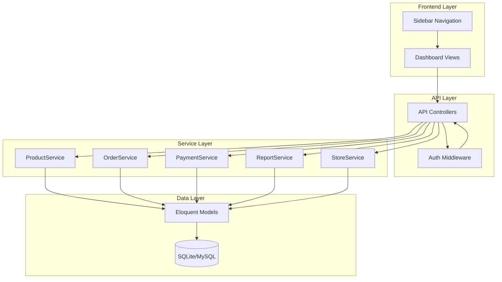
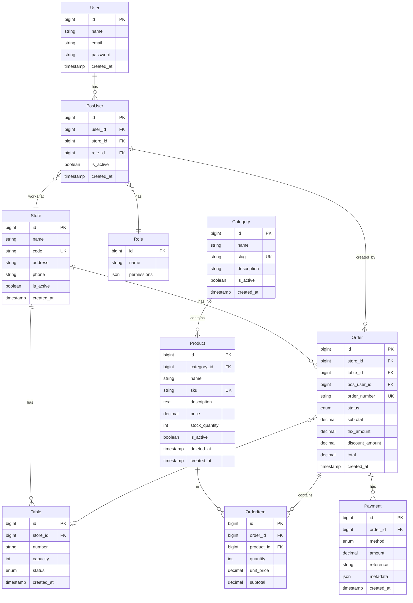

# Design Document: Point of Sale System

## Overview

The Point of Sale (POS) system is a comprehensive module integrated into the QashierWise Dashboard that enables businesses to manage products, process sales transactions, handle payments, and generate analytics. The system is built on Laravel 11 with a RESTful API backend and Blade-based frontend views.

## Architecture



## Components and Interfaces

### Controllers

| Controller | Responsibility |
|------------|----------------|
| `ProductController` | CRUD operations for products |
| `CategoryController` | CRUD operations for categories |
| `OrderController` | Order creation, updates, and status management |
| `PaymentController` | Payment processing and recording |
| `StoreController` | Store management |
| `TableController` | Table management for restaurants |
| `PosUserController` | Staff user management |
| `ReportController` | Sales reports and analytics |
| `TransactionController` | Transaction history |

### Services

| Service | Responsibility |
|---------|----------------|
| `ProductService` | Product business logic, SKU generation, inventory |
| `OrderService` | Order calculations, status transitions, inventory updates |
| `PaymentService` | Payment processing, change calculation, split payments |
| `ReportService` | Report aggregation, date filtering |
| `StoreService` | Store operations, table management |

### Interfaces

```php
interface ProductServiceInterface {
    public function create(array $data): Product;
    public function update(Product $product, array $data): Product;
    public function delete(Product $product): bool;
    public function search(string $query): Collection;
    public function generateSku(string $name, int $categoryId): string;
}

interface OrderServiceInterface {
    public function create(array $data): Order;
    public function addItem(Order $order, Product $product, int $quantity): OrderItem;
    public function removeItem(Order $order, OrderItem $item): void;
    public function applyDiscount(Order $order, float $discount): Order;
    public function calculateTotals(Order $order): array;
    public function complete(Order $order): Order;
    public function cancel(Order $order): Order;
}

interface PaymentServiceInterface {
    public function processPayment(Order $order, array $paymentData): Payment;
    public function calculateChange(float $amountPaid, float $orderTotal): float;
    public function splitPayment(Order $order, array $payments): Collection;
}

interface ReportServiceInterface {
    public function dailySales(Carbon $date, ?int $storeId = null): array;
    public function salesByRange(Carbon $start, Carbon $end, ?int $storeId = null): array;
    public function topProducts(Carbon $start, Carbon $end, int $limit = 10): Collection;
}
```

## Data Models

### Entity Relationship Diagram



### Model Definitions

#### Product Model
```php
class Product extends Model {
    protected $fillable = [
        'category_id', 'name', 'sku', 'description', 
        'price', 'stock_quantity', 'is_active'
    ];
    
    protected $casts = [
        'price' => 'decimal:2',
        'is_active' => 'boolean',
    ];
    
    use SoftDeletes;
}
```

#### Order Model
```php
class Order extends Model {
    protected $fillable = [
        'store_id', 'table_id', 'pos_user_id', 'order_number',
        'status', 'subtotal', 'tax_amount', 'discount_amount', 'total'
    ];
    
    protected $casts = [
        'subtotal' => 'decimal:2',
        'tax_amount' => 'decimal:2',
        'discount_amount' => 'decimal:2',
        'total' => 'decimal:2',
    ];
    
    const STATUS_PENDING = 'pending';
    const STATUS_COMPLETED = 'completed';
    const STATUS_CANCELLED = 'cancelled';
    const STATUS_PAID = 'paid';
}
```

## Correctness Properties

*A property is a characteristic or behavior that should hold true across all valid executions of a system-essentially, a formal statement about what the system should do. Properties serve as the bridge between human-readable specifications and machine-verifiable correctness guarantees.*

### Property 1: Product Serialization Round-Trip
*For any* valid Product object, serializing to JSON and then deserializing back SHALL produce an equivalent Product object with identical field values.
**Validates: Requirements 1.6, 1.7**

### Property 2: Category Serialization Round-Trip
*For any* valid Category object, serializing to JSON and then deserializing back SHALL produce an equivalent Category object with identical field values.
**Validates: Requirements 2.5, 2.6**

### Property 3: Order Total Invariant
*For any* Order with items, the total SHALL always equal (sum of all item subtotals) + tax_amount - discount_amount.
**Validates: Requirements 3.2, 3.3, 3.4**

### Property 4: Order Serialization Round-Trip
*For any* valid Order object with items, serializing to JSON and then deserializing back SHALL produce an equivalent Order object with identical calculated totals.
**Validates: Requirements 3.7, 3.8**

### Property 5: Inventory Consistency on Order Completion
*For any* completed Order, the stock_quantity of each product SHALL be decreased by the ordered quantity.
**Validates: Requirements 3.5**

### Property 6: Inventory Restoration on Order Cancellation
*For any* cancelled Order that was previously completed, the stock_quantity of each product SHALL be restored to the pre-completion value.
**Validates: Requirements 3.6**

### Property 7: Payment Change Calculation
*For any* cash Payment where amount_paid >= order_total, the calculated change SHALL equal amount_paid - order_total.
**Validates: Requirements 4.2**

### Property 8: Split Payment Total Invariant
*For any* Order with split payments, the sum of all payment amounts SHALL equal or exceed the order total.
**Validates: Requirements 4.4, 4.5**

### Property 9: Payment Serialization Round-Trip
*For any* valid Payment object, serializing to JSON and then deserializing back SHALL produce an equivalent Payment object.
**Validates: Requirements 4.6, 4.7**

### Property 10: Store Serialization Round-Trip
*For any* valid Store object, serializing to JSON and then deserializing back SHALL produce an equivalent Store object.
**Validates: Requirements 5.5, 5.6**

### Property 11: Inactive Store Order Rejection
*For any* Store with is_active = false, attempting to create a new Order SHALL be rejected.
**Validates: Requirements 5.3**

### Property 12: Table Status State Transition
*For any* Table, assigning an Order SHALL change status to 'occupied', and completing/cancelling that Order SHALL change status back to 'available'.
**Validates: Requirements 6.2, 6.3**

### Property 13: Table Serialization Round-Trip
*For any* valid Table object, serializing to JSON and then deserializing back SHALL produce an equivalent Table object.
**Validates: Requirements 6.5, 6.6**

### Property 14: Staff User Serialization Round-Trip
*For any* valid PosUser object, serializing to JSON and then deserializing back SHALL produce an equivalent PosUser object with role information.
**Validates: Requirements 7.5, 7.6**

### Property 15: Report Date Range Aggregation
*For any* date range report, the total sales SHALL equal the sum of all individual daily totals within that range.
**Validates: Requirements 8.1, 8.2**

### Property 16: Report Store Filter Consistency
*For any* report filtered by store_id, all included transactions SHALL belong to that store.
**Validates: Requirements 8.3**

### Property 17: Transaction Search Accuracy
*For any* transaction search by order_number, all returned results SHALL contain the exact order_number.
**Validates: Requirements 9.2**

### Property 18: Transaction Date Filter Consistency
*For any* transaction filter by date, all returned transactions SHALL have created_at within the specified date.
**Validates: Requirements 9.3**

### Property 19: Permission-Based Menu Visibility
*For any* user with a specific role, the visible menu items SHALL only include items authorized by that role's permissions.
**Validates: Requirements 10.3**

## Responsive Design Strategy

### Breakpoints (Following Existing Pattern)
- **Mobile**: < 768px (single column, bottom navigation)
- **Tablet**: 768px - 1024px (collapsed sidebar, 2-column grid)
- **Desktop**: > 1024px (full sidebar, multi-column grid)

### Component Responsiveness
| Component | Mobile | Tablet | Desktop |
|-----------|--------|--------|---------|
| Sidebar | Hidden (hamburger menu) | Collapsed (icons only) | Expandable |
| Data Tables | Card-based layout | Horizontal scroll | Full table |
| Modals | Full-screen | Centered (80% width) | Centered (max 600px) |
| Forms | Single column | Single column | Two columns |
| Action Buttons | Bottom fixed bar | Inline | Inline |

### CSS Classes (Extend Existing)
```css
/* Mobile-first approach */
.pos-card { @apply w-full p-4; }
.pos-table-mobile { @apply block lg:table; }
.pos-modal { @apply fixed inset-0 lg:inset-auto lg:max-w-xl; }

/* Responsive grid */
.pos-grid { @apply grid grid-cols-1 md:grid-cols-2 lg:grid-cols-3 gap-4; }
```

### Alpine.js Responsive State
```javascript
// Reuse existing responsive detection
x-data="{ 
    isMobile: window.innerWidth < 768,
    isTablet: window.innerWidth >= 768 && window.innerWidth < 1024
}"
```

## Backward Compatibility Guidelines

### Protected Components (DO NOT MODIFY)
- `app/Models/User.php` - Only add new relationships, no changes to existing
- `app/Models/WhatsApp*.php` - No modifications
- `resources/views/dashboard/index.blade.php` - No modifications
- `resources/views/dashboard/contacts.blade.php` - No modifications
- `resources/views/dashboard/messages.blade.php` - No modifications
- `resources/views/dashboard/templates.blade.php` - No modifications
- `resources/views/dashboard/profile.blade.php` - No modifications
- `routes/api.php` - Only add new routes, no changes to existing
- `routes/web.php` - Only add new routes, no changes to existing

### Safe Modification Areas
- `resources/views/components/dashboard-sidebar.blade.php` - Add new menu items only
- `resources/css/app.css` - Add new classes with `pos-` prefix
- `app/Providers/AppServiceProvider.php` - Register new services

### Migration Safety Rules
1. Never use `Schema::dropIfExists` on existing tables
2. Never modify columns in existing tables
3. Use separate migration files for POS tables
4. Prefix all POS tables with `pos_` or use distinct names

## Error Handling

| Error Scenario | Response Code | Message |
|----------------|---------------|---------|
| Product not found | 404 | "Product not found" |
| Invalid product data | 422 | Validation errors |
| Insufficient stock | 400 | "Insufficient stock for {product}" |
| Category has products | 400 | "Cannot delete category with products" |
| Order already completed | 400 | "Order is already completed" |
| Invalid payment amount | 422 | "Payment amount must be positive" |
| Store inactive | 400 | "Cannot create order at inactive store" |
| Unauthorized access | 403 | "You do not have permission" |

## Testing Strategy

### Unit Testing
- Test individual service methods in isolation
- Test model relationships and accessors
- Test validation rules
- Use PHPUnit for all unit tests

### Property-Based Testing
- Use `phpunit/phpunit` with custom generators for property-based tests
- Configure minimum 100 iterations per property test
- Each property test must reference the correctness property it validates
- Format: `**Feature: point-of-sale, Property {number}: {property_text}**`

### Test Organization
```
tests/
├── Unit/
│   ├── Services/
│   │   ├── ProductServiceTest.php
│   │   ├── OrderServiceTest.php
│   │   ├── PaymentServiceTest.php
│   │   └── ReportServiceTest.php
│   └── Models/
│       ├── ProductTest.php
│       ├── OrderTest.php
│       └── ...
├── Feature/
│   └── Api/
│       ├── ProductApiTest.php
│       ├── OrderApiTest.php
│       └── ...
└── Property/
    ├── ProductPropertyTest.php
    ├── OrderPropertyTest.php
    ├── PaymentPropertyTest.php
    └── ...
```

### Property Test Implementation
Each property-based test will:
1. Generate random valid inputs using Faker
2. Execute the operation under test
3. Assert the property holds
4. Run minimum 100 iterations
5. Include comment referencing the design property
