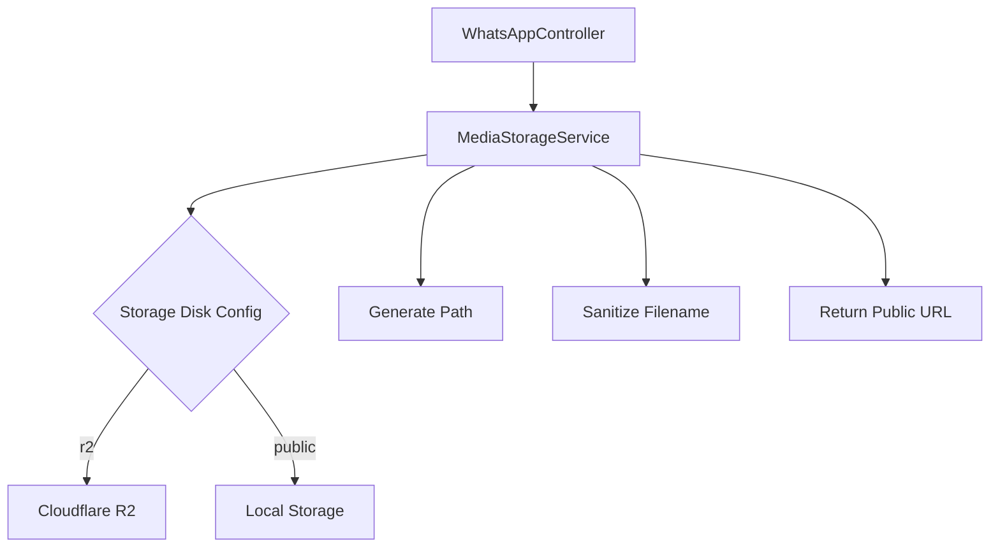
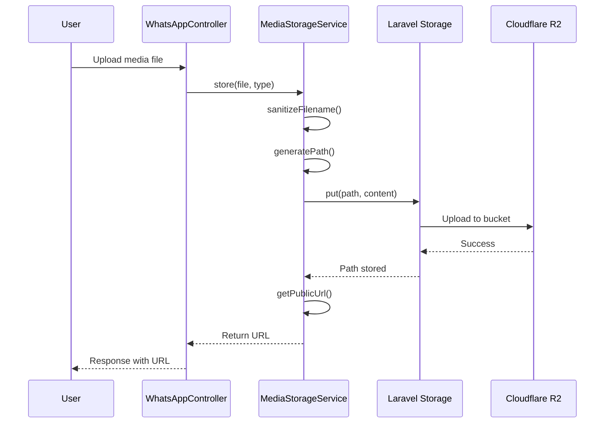

# Design Document: R2 Media Storage

## Overview

Fitur ini mengintegrasikan Cloudflare R2 Object Storage sebagai backend penyimpanan untuk file media WhatsApp. R2 adalah layanan object storage yang S3-compatible, sehingga dapat menggunakan Laravel's S3 driver dengan konfigurasi endpoint khusus.

Implementasi akan membuat service class terpusat (`MediaStorageService`) yang menangani semua operasi upload media, menggantikan method `storeMediaLocally()` yang ada di `WhatsAppController`.

## Architecture



### Flow Diagram



## Components and Interfaces

### 1. MediaStorageService

Service class utama untuk menangani penyimpanan media.

```php
<?php

namespace App\Services;

use Illuminate\Http\UploadedFile;

class MediaStorageService
{
    /**
     * Store media file to configured storage disk
     * 
     * @param UploadedFile $file
     * @param string $type Media type (image, document, audio, video)
     * @return array{url: string, path: string, filename: string}
     */
    public function store(UploadedFile $file, string $type): array;

    /**
     * Get the storage disk name based on configuration
     * 
     * @return string
     */
    public function getDiskName(): string;

    /**
     * Generate storage path for media file
     * 
     * @param string $type
     * @param string $filename
     * @return string
     */
    public function generatePath(string $type, string $filename): string;

    /**
     * Sanitize filename by removing special characters
     * 
     * @param string $filename
     * @return string
     */
    public function sanitizeFilename(string $filename): string;

    /**
     * Generate unique filename with timestamp prefix
     * 
     * @param string $originalFilename
     * @return string
     */
    public function generateUniqueFilename(string $originalFilename): string;

    /**
     * Get public URL for stored file
     * 
     * @param string $path
     * @return string
     */
    public function getPublicUrl(string $path): string;

    /**
     * Delete media file from storage
     * 
     * @param string $path
     * @return bool
     */
    public function delete(string $path): bool;
}
```

### 2. Configuration Files

#### config/filesystems.php (R2 disk addition)

```php
'r2' => [
    'driver' => 's3',
    'key' => env('R2_ACCESS_KEY_ID'),
    'secret' => env('R2_SECRET_ACCESS_KEY'),
    'region' => env('R2_REGION', 'auto'),
    'bucket' => env('R2_BUCKET'),
    'url' => env('R2_URL'),
    'endpoint' => env('R2_ENDPOINT'),
    'use_path_style_endpoint' => false,
    'visibility' => 'public',
    'throw' => true,
],
```

#### Environment Variables

```
R2_ACCESS_KEY_ID=your_access_key
R2_SECRET_ACCESS_KEY=your_secret_key
R2_BUCKET=your_bucket_name
R2_ENDPOINT=https://your_account_id.r2.cloudflarestorage.com
R2_URL=https://your_public_domain.com
R2_REGION=auto
FILESYSTEM_DISK=r2
```

## Data Models

### WhatsAppMedia Model (existing)

Model yang sudah ada akan tetap digunakan. Field `local_path` akan menyimpan path relatif, dan `url` akan menyimpan public URL dari R2.

```php
// Existing fields yang relevan:
- url: string          // Public URL (R2 atau local)
- local_path: string   // Relative path dalam storage
- mime_type: string    // MIME type file
- filename: string     // Original filename
```

### Message Content Structure

Untuk setiap tipe media, content akan menyimpan URL:

```php
// Image
['url' => 'https://r2.example.com/whatsapp/images/...', 'caption' => '...']

// Document
['url' => 'https://r2.example.com/whatsapp/documents/...', 'filename' => '...', 'caption' => '...']

// Audio
['url' => 'https://r2.example.com/whatsapp/audio/...']

// Video
['url' => 'https://r2.example.com/whatsapp/videos/...', 'caption' => '...']
```

## Correctness Properties

*A property is a characteristic or behavior that should hold true across all valid executions of a system-essentially, a formal statement about what the system should do. Properties serve as the bridge between human-readable specifications and machine-verifiable correctness guarantees.*

Based on the prework analysis, the following consolidated properties have been identified:

### Property 1: Path Generation Pattern

*For any* media type (image, document, audio, video) and *for any* filename, the generated storage path SHALL follow the pattern `whatsapp/{type}s/{timestamp}_{sanitized_filename}`.

**Validates: Requirements 2.1, 3.1, 4.1, 5.1**

### Property 2: Filename Sanitization

*For any* input filename containing special characters, the sanitized output SHALL only contain alphanumeric characters, dots, underscores, and hyphens.

**Validates: Requirements 6.2**

### Property 3: Unique Filename Generation

*For any* original filename, the generated unique filename SHALL have a numeric timestamp prefix followed by underscore and the sanitized original filename.

**Validates: Requirements 6.3**

### Property 4: MIME Type Detection

*For any* uploaded file with a known extension (jpg, png, pdf, mp3, mp4, etc.), the detected MIME type SHALL match the expected content-type for that extension.

**Validates: Requirements 6.4**

### Property 5: URL Format Validity

*For any* stored media file, regardless of storage backend (R2 or local), the returned URL SHALL be a valid URL string starting with "http://" or "https://".

**Validates: Requirements 7.3, 2.2, 3.2, 4.2, 5.2**

## Error Handling

### Upload Failures

```php
try {
    $result = $mediaService->store($file, $type);
} catch (\Illuminate\Contracts\Filesystem\FileNotFoundException $e) {
    // File tidak ditemukan
    Log::error('Media upload failed: File not found', ['error' => $e->getMessage()]);
    return response()->json(['error' => 'File not found'], 400);
} catch (\League\Flysystem\UnableToWriteFile $e) {
    // Gagal menulis ke storage
    Log::error('Media upload failed: Unable to write', ['error' => $e->getMessage()]);
    return response()->json(['error' => 'Storage write failed'], 500);
} catch (\Exception $e) {
    // Error umum
    Log::error('Media upload failed', ['error' => $e->getMessage()]);
    return response()->json(['error' => 'Upload failed'], 500);
}
```

### Configuration Validation

Saat aplikasi boot, service akan memvalidasi konfigurasi R2:

```php
public function validateConfiguration(): bool
{
    if ($this->getDiskName() !== 'r2') {
        return true; // Local storage doesn't need validation
    }

    $required = ['R2_ACCESS_KEY_ID', 'R2_SECRET_ACCESS_KEY', 'R2_BUCKET', 'R2_ENDPOINT'];
    foreach ($required as $key) {
        if (empty(env($key))) {
            Log::warning("R2 configuration missing: {$key}. Falling back to local storage.");
            return false;
        }
    }
    return true;
}
```

## Testing Strategy

### Property-Based Testing

Menggunakan **PHPUnit** dengan **eris/eris** library untuk property-based testing di PHP.

Setiap property test akan:
- Generate random inputs sesuai dengan domain
- Menjalankan minimal 100 iterasi
- Di-tag dengan referensi ke correctness property

```php
/**
 * @test
 * Feature: r2-media-storage, Property 2: Filename Sanitization
 * Validates: Requirements 6.2
 */
public function sanitized_filename_contains_only_allowed_characters()
{
    $this->forAll(Generator\string())
        ->then(function ($filename) {
            $service = new MediaStorageService();
            $sanitized = $service->sanitizeFilename($filename);
            
            $this->assertMatchesRegularExpression(
                '/^[a-zA-Z0-9._-]*$/',
                $sanitized
            );
        });
}
```

### Unit Testing

Unit tests untuk specific examples dan edge cases:

1. **Configuration Tests**
   - Test R2 disk selection when FILESYSTEM_DISK=r2
   - Test local disk selection when FILESYSTEM_DISK=public
   - Test fallback when R2 credentials missing

2. **Upload Tests**
   - Test successful image upload
   - Test successful document upload
   - Test upload failure handling

3. **URL Generation Tests**
   - Test R2 URL format
   - Test local URL format

### Test File Structure

```
tests/
├── Unit/
│   └── Services/
│       └── MediaStorageServiceTest.php
└── Feature/
    └── MediaUploadTest.php
```
