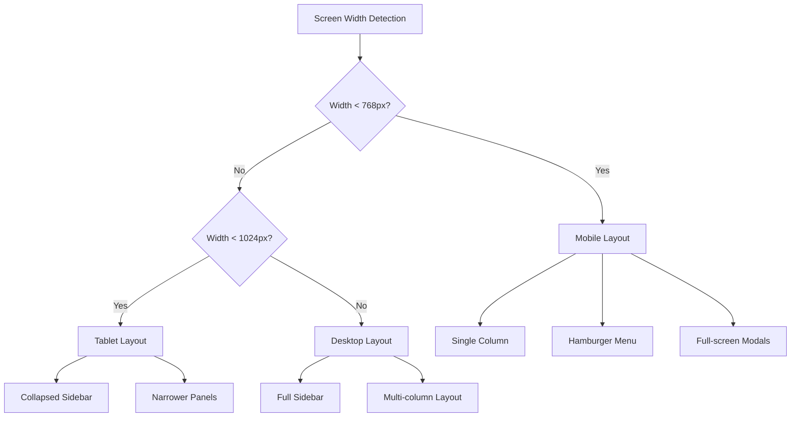

# Design Document: Responsive Dashboard UI

## Overview

Fitur ini mengimplementasikan responsive design untuk seluruh aplikasi QashierWise, memastikan pengalaman pengguna yang optimal di berbagai ukuran layar. Implementasi menggunakan pendekatan mobile-first dengan Tailwind CSS breakpoints dan Alpine.js untuk interaktivitas.

### Breakpoints

| Breakpoint | Width | Target Device |
|------------|-------|---------------|
| Mobile | < 768px | Smartphones |
| Tablet | 768px - 1024px | Tablets, small laptops |
| Desktop | > 1024px | Desktops, large screens |

## Architecture

### Responsive Strategy



### State Management

Alpine.js akan mengelola state untuk:
- `isMobile`: Boolean untuk deteksi mobile viewport
- `sidebarOpen`: Boolean untuk toggle sidebar visibility
- `mobileView`: String ('contacts' | 'chat') untuk Messages page view state
- `menuOpen`: Boolean untuk mobile navigation menu

## Components and Interfaces

### 1. Responsive Navigation Component

```javascript
// Alpine.js component untuk responsive navigation
function responsiveNav() {
    return {
        menuOpen: false,
        isMobile: window.innerWidth < 768,
        
        init() {
            window.addEventListener('resize', () => {
                this.isMobile = window.innerWidth < 768;
                if (!this.isMobile) this.menuOpen = false;
            });
        },
        
        toggleMenu() {
            this.menuOpen = !this.menuOpen;
        },
        
        closeMenu() {
            this.menuOpen = false;
        }
    }
}
```

### 2. Mobile Messages View Component

```javascript
// Alpine.js component untuk mobile messages view
function mobileMessagesView() {
    return {
        mobileView: 'contacts', // 'contacts' | 'chat'
        isMobile: window.innerWidth < 768,
        
        init() {
            window.addEventListener('resize', () => {
                this.isMobile = window.innerWidth < 768;
                if (!this.isMobile) this.mobileView = 'contacts';
            });
        },
        
        selectContact(contact) {
            // existing logic...
            if (this.isMobile) {
                this.mobileView = 'chat';
            }
        },
        
        backToContacts() {
            this.mobileView = 'contacts';
        }
    }
}
```

### 3. Dashboard Sidebar Component

```javascript
// Enhanced sidebar component
function dashboardSidebar() {
    return {
        sidebarOpen: window.innerWidth >= 1024,
        isMobile: window.innerWidth < 768,
        isTablet: window.innerWidth >= 768 && window.innerWidth < 1024,
        
        init() {
            window.addEventListener('resize', () => {
                const width = window.innerWidth;
                this.isMobile = width < 768;
                this.isTablet = width >= 768 && width < 1024;
                
                // Auto-adjust sidebar state based on viewport
                if (this.isMobile) {
                    this.sidebarOpen = false;
                } else if (this.isTablet) {
                    this.sidebarOpen = false; // Collapsed by default
                } else {
                    this.sidebarOpen = true;
                }
            });
        },
        
        toggleSidebar() {
            this.sidebarOpen = !this.sidebarOpen;
        }
    }
}
```

## Data Models

Tidak ada perubahan pada data models. Fitur ini hanya mengubah presentasi UI.

## Correctness Properties

*A property is a characteristic or behavior that should hold true across all valid executions of a system-essentially, a formal statement about what the system should do. Properties serve as the bridge between human-readable specifications and machine-verifiable correctness guarantees.*

### Property 1: Mobile Layout Single Column
*For any* page with grid/card layouts (Welcome features, pricing, Contacts, Templates), when viewport width is less than 768px, the layout SHALL display items in a single column.
**Validates: Requirements 1.4, 1.5, 9.1, 10.1**

### Property 2: Mobile Navigation Visibility
*For any* viewport width less than 768px, the hamburger menu button SHALL be visible AND the horizontal navigation links SHALL be hidden on Welcome page, AND the dashboard sidebar SHALL be hidden by default.
**Validates: Requirements 1.1, 3.1, 3.2**

### Property 3: Responsive Typography
*For any* heading or body text element, when viewport width is less than 768px, the computed font size SHALL be smaller than or equal to the desktop font size.
**Validates: Requirements 1.6, 2.3, 7.3**

### Property 4: Touch Target Sizing
*For any* interactive element (buttons, inputs) on mobile viewport, the minimum height SHALL be at least 44px for comfortable touch interaction.
**Validates: Requirements 2.2, 6.3**

### Property 5: Messages Page Mobile View State
*For any* mobile viewport on Messages page, exactly one of contacts list OR chat area SHALL be visible at any time (mutually exclusive views).
**Validates: Requirements 4.1, 4.4**

### Property 6: Tablet Contacts Sidebar Width
*For any* viewport width between 768px and 1024px on Messages page, the contacts sidebar width SHALL be 240px (narrower than desktop 320px).
**Validates: Requirements 5.1**

### Property 7: Sidebar Transition Duration
*For any* sidebar open/close animation, the transition duration SHALL be 300ms.
**Validates: Requirements 8.1**

### Property 8: Form Card Mobile Width
*For any* authentication page form card on mobile viewport, the width SHALL be 100% minus horizontal padding.
**Validates: Requirements 2.1**

### Property 9: Mobile Message Bubble Width
*For any* message bubble on mobile viewport, the maximum width SHALL be 85% of the container width.
**Validates: Requirements 4.5**

### Property 10: Mobile Attachment Menu Simplification
*For any* mobile viewport on Messages page, the attachment menu SHALL display fewer options than desktop view.
**Validates: Requirements 6.1**

## Error Handling

### Viewport Detection Fallback
- Jika `window.innerWidth` tidak tersedia, default ke desktop layout
- Gunakan CSS media queries sebagai fallback untuk JavaScript-disabled browsers

### Transition Failures
- Jika CSS transitions tidak didukung, layout changes tetap terjadi tanpa animasi
- Gunakan `@supports` untuk feature detection

## Testing Strategy

### Dual Testing Approach

#### Unit Tests
- Test Alpine.js component initialization
- Test state changes (menuOpen, mobileView, sidebarOpen)
- Test resize event handlers

#### Property-Based Tests
Menggunakan **fast-check** library untuk JavaScript property-based testing.

Setiap property test HARUS:
1. Di-tag dengan format: `**Feature: responsive-dashboard-ui, Property {number}: {property_text}**`
2. Menjalankan minimal 100 iterasi
3. Generate random viewport widths dalam range yang valid

### Test Structure

```javascript
// Example property test structure
import fc from 'fast-check';

describe('Responsive UI Properties', () => {
    // **Feature: responsive-dashboard-ui, Property 1: Mobile Layout Single Column**
    test('mobile viewport displays single column layout', () => {
        fc.assert(
            fc.property(
                fc.integer({ min: 320, max: 767 }), // mobile widths
                (width) => {
                    // Set viewport width
                    // Assert single column layout
                    return true; // property holds
                }
            ),
            { numRuns: 100 }
        );
    });
});
```

### Visual Regression Testing
- Capture screenshots at each breakpoint
- Compare against baseline images
- Flag visual differences for review
