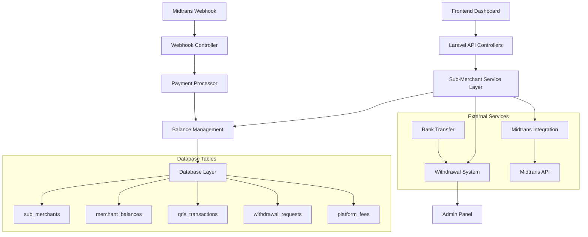

# Design Document: Sub-Merchant QRIS System

## Overview

The Sub-Merchant QRIS System enables users to become payment processors by generating dynamic QRIS codes for their customers, managing earnings with automatic platform fee deduction, and requesting withdrawals to their registered bank accounts. The system integrates with Midtrans payment gateway and provides comprehensive balance management with admin oversight.

## Architecture

### System Components



### Technology Stack

- **Backend**: Laravel 11 with PHP 8.2+
- **Database**: MySQL/PostgreSQL with proper indexing
- **Payment Gateway**: Midtrans QRIS API
- **Queue System**: Laravel Queues for async processing
- **Storage**: Laravel Storage for QR code images
- **Authentication**: Laravel Sanctum for API security
- **Frontend**: Blade templates with Alpine.js for interactivity

## Components and Interfaces

### 1. Sub-Merchant Management

#### SubMerchant Model
```php
class SubMerchant extends Model
{
    protected $fillable = [
        'user_id', 'bank_name', 'account_number', 
        'account_holder_name', 'is_active', 'verified_at'
    ];
    
    public function user(): BelongsTo;
    public function balance(): HasOne;
    public function transactions(): HasMany;
    public function withdrawalRequests(): HasMany;
}
```

#### SubMerchantService
```php
class SubMerchantService
{
    public function registerSubMerchant(User $user, array $bankDetails): SubMerchant;
    public function updateBankAccount(SubMerchant $merchant, array $bankDetails): bool;
    public function validateBankAccount(array $bankDetails): bool;
    public function activateSubMerchant(SubMerchant $merchant): bool;
}
```

### 2. QRIS Generation System

#### QrisTransaction Model
```php
class QrisTransaction extends Model
{
    protected $fillable = [
        'sub_merchant_id', 'order_id', 'amount', 'status',
        'midtrans_transaction_id', 'qr_code_url', 'expires_at'
    ];
    
    public function subMerchant(): BelongsTo;
    public function isExpired(): bool;
    public function getShareableLink(): string;
}
```

#### QrisService
```php
class QrisService
{
    public function generateQris(SubMerchant $merchant, float $amount, array $details): QrisTransaction;
    public function getMidtransQrCode(string $transactionId): string;
    public function generateShareableLink(QrisTransaction $transaction): string;
    public function validateQrisExpiry(QrisTransaction $transaction): bool;
}
```

### 3. Balance Management System

#### MerchantBalance Model
```php
class MerchantBalance extends Model
{
    protected $fillable = [
        'sub_merchant_id', 'available_balance', 'pending_balance', 
        'total_earned', 'total_withdrawn', 'last_updated'
    ];
    
    public function subMerchant(): BelongsTo;
    public function transactions(): HasMany;
    public function canWithdraw(float $amount): bool;
}
```

#### BalanceService
```php
class BalanceService
{
    public function updateBalance(SubMerchant $merchant, float $amount, string $type): void;
    public function calculatePlatformFee(float $amount): float;
    public function processPaymentSuccess(QrisTransaction $transaction): void;
    public function getBalanceHistory(SubMerchant $merchant): Collection;
}
```

### 4. Withdrawal System

#### WithdrawalRequest Model
```php
class WithdrawalRequest extends Model
{
    protected $fillable = [
        'sub_merchant_id', 'amount', 'status', 'bank_details',
        'admin_notes', 'processed_at', 'processed_by'
    ];
    
    public function subMerchant(): BelongsTo;
    public function processedBy(): BelongsTo;
    public function canBeProcessed(): bool;
}
```

#### WithdrawalService
```php
class WithdrawalService
{
    public function createWithdrawalRequest(SubMerchant $merchant, float $amount): WithdrawalRequest;
    public function validateWithdrawal(SubMerchant $merchant, float $amount): bool;
    public function approveWithdrawal(WithdrawalRequest $request, User $admin): bool;
    public function rejectWithdrawal(WithdrawalRequest $request, User $admin, string $reason): bool;
}
```

### 5. Webhook Processing

#### WebhookController
```php
class MidtransWebhookController extends Controller
{
    public function handleNotification(Request $request): JsonResponse;
    private function validateSignature(array $data): bool;
    private function processPaymentNotification(array $data): void;
}
```

## Data Models

### Database Schema

#### sub_merchants Table
```sql
CREATE TABLE sub_merchants (
    id BIGINT PRIMARY KEY AUTO_INCREMENT,
    user_id BIGINT NOT NULL,
    bank_name VARCHAR(100) NOT NULL,
    account_number VARCHAR(50) NOT NULL,
    account_holder_name VARCHAR(100) NOT NULL,
    is_active BOOLEAN DEFAULT true,
    verified_at TIMESTAMP NULL,
    created_at TIMESTAMP DEFAULT CURRENT_TIMESTAMP,
    updated_at TIMESTAMP DEFAULT CURRENT_TIMESTAMP ON UPDATE CURRENT_TIMESTAMP,
    
    FOREIGN KEY (user_id) REFERENCES users(id) ON DELETE CASCADE,
    UNIQUE KEY unique_user_merchant (user_id),
    INDEX idx_active_merchants (is_active, verified_at)
);
```

#### merchant_balances Table
```sql
CREATE TABLE merchant_balances (
    id BIGINT PRIMARY KEY AUTO_INCREMENT,
    sub_merchant_id BIGINT NOT NULL,
    available_balance DECIMAL(15,2) DEFAULT 0.00,
    pending_balance DECIMAL(15,2) DEFAULT 0.00,
    total_earned DECIMAL(15,2) DEFAULT 0.00,
    total_withdrawn DECIMAL(15,2) DEFAULT 0.00,
    last_updated TIMESTAMP DEFAULT CURRENT_TIMESTAMP ON UPDATE CURRENT_TIMESTAMP,
    created_at TIMESTAMP DEFAULT CURRENT_TIMESTAMP,
    updated_at TIMESTAMP DEFAULT CURRENT_TIMESTAMP ON UPDATE CURRENT_TIMESTAMP,
    
    FOREIGN KEY (sub_merchant_id) REFERENCES sub_merchants(id) ON DELETE CASCADE,
    UNIQUE KEY unique_merchant_balance (sub_merchant_id),
    INDEX idx_balance_lookup (sub_merchant_id, available_balance)
);
```

#### qris_transactions Table
```sql
CREATE TABLE qris_transactions (
    id BIGINT PRIMARY KEY AUTO_INCREMENT,
    sub_merchant_id BIGINT NOT NULL,
    order_id VARCHAR(100) NOT NULL UNIQUE,
    amount DECIMAL(15,2) NOT NULL,
    platform_fee DECIMAL(15,2) NOT NULL,
    net_amount DECIMAL(15,2) NOT NULL,
    status ENUM('pending', 'settlement', 'expire', 'cancel') DEFAULT 'pending',
    midtrans_transaction_id VARCHAR(100),
    qr_code_url TEXT,
    expires_at TIMESTAMP,
    settled_at TIMESTAMP NULL,
    created_at TIMESTAMP DEFAULT CURRENT_TIMESTAMP,
    updated_at TIMESTAMP DEFAULT CURRENT_TIMESTAMP ON UPDATE CURRENT_TIMESTAMP,
    
    FOREIGN KEY (sub_merchant_id) REFERENCES sub_merchants(id) ON DELETE CASCADE,
    INDEX idx_merchant_transactions (sub_merchant_id, status, created_at),
    INDEX idx_order_lookup (order_id),
    INDEX idx_midtrans_lookup (midtrans_transaction_id)
);
```

#### withdrawal_requests Table
```sql
CREATE TABLE withdrawal_requests (
    id BIGINT PRIMARY KEY AUTO_INCREMENT,
    sub_merchant_id BIGINT NOT NULL,
    amount DECIMAL(15,2) NOT NULL,
    status ENUM('pending', 'approved', 'rejected', 'processed') DEFAULT 'pending',
    bank_details JSON NOT NULL,
    admin_notes TEXT NULL,
    processed_at TIMESTAMP NULL,
    processed_by BIGINT NULL,
    created_at TIMESTAMP DEFAULT CURRENT_TIMESTAMP,
    updated_at TIMESTAMP DEFAULT CURRENT_TIMESTAMP ON UPDATE CURRENT_TIMESTAMP,
    
    FOREIGN KEY (sub_merchant_id) REFERENCES sub_merchants(id) ON DELETE CASCADE,
    FOREIGN KEY (processed_by) REFERENCES users(id) ON DELETE SET NULL,
    INDEX idx_merchant_withdrawals (sub_merchant_id, status, created_at),
    INDEX idx_pending_withdrawals (status, created_at)
);
```

#### platform_fees Table
```sql
CREATE TABLE platform_fees (
    id BIGINT PRIMARY KEY AUTO_INCREMENT,
    qris_transaction_id BIGINT NOT NULL,
    fee_percentage DECIMAL(5,4) NOT NULL DEFAULT 2.5000,
    fee_amount DECIMAL(15,2) NOT NULL,
    collected_at TIMESTAMP DEFAULT CURRENT_TIMESTAMP,
    
    FOREIGN KEY (qris_transaction_id) REFERENCES qris_transactions(id) ON DELETE CASCADE,
    INDEX idx_fee_collection (collected_at, fee_amount)
);
```

## Correctness Properties

*A property is a characteristic or behavior that should hold true across all valid executions of a system-essentially, a formal statement about what the system should do. Properties serve as the bridge between human-readable specifications and machine-verifiable correctness guarantees.*

### Property Reflection

After analyzing all acceptance criteria, I identified several areas where properties can be consolidated to eliminate redundancy:

- **Balance Management**: Properties 3.4, 4.1, and 4.4 all relate to balance updates and can be combined into comprehensive balance consistency properties
- **Fee Calculation**: Properties 3.2 and 3.3 both deal with fee calculation and can be unified
- **Validation Properties**: Properties 1.1, 1.3, 5.1, and 5.2 all involve input validation and can be streamlined
- **Security Properties**: Properties 9.1, 9.2, and 9.5 all relate to security and audit requirements

### Core Properties

**Property 1: Bank Account Validation Consistency**
*For any* bank account data submitted for sub-merchant registration, the system should validate all required fields (bank name, account number, account holder name) and reject incomplete or invalid data
**Validates: Requirements 1.1, 1.3**

**Property 2: Sub-Merchant Registration Initialization**
*For any* successful sub-merchant registration, the system should initialize the merchant balance to zero and create all necessary related records
**Validates: Requirements 1.5, 10.2**

**Property 3: QRIS Order ID Uniqueness**
*For any* QRIS generation request, the system should generate a unique order_id that has never been used before
**Validates: Requirements 2.1**

**Property 4: QRIS Generation Completeness**
*For any* successful QRIS generation, the system should provide both QR code image and shareable link formats
**Validates: Requirements 2.3, 8.1, 8.2**

**Property 5: QRIS Expiration Prevention**
*For any* QRIS code that is expired or already used, attempting to use it again should be rejected by the system
**Validates: Requirements 2.5, 8.3**

**Property 6: Platform Fee Calculation Accuracy**
*For any* transaction amount, the platform fee should be calculated as exactly 2.5% of the gross amount, and the net amount should equal gross minus fee
**Validates: Requirements 3.2, 3.3**

**Property 7: Balance Update Consistency**
*For any* successful payment, the sub-merchant's available balance should increase by the net amount (gross - platform fee) and the transaction should be logged
**Validates: Requirements 3.4, 3.5, 4.4**

**Property 8: Balance Non-Negativity**
*For any* balance operation (payment, withdrawal, adjustment), the available balance should never become negative
**Validates: Requirements 4.5**

**Property 9: Withdrawal Validation Rules**
*For any* withdrawal request, the system should enforce the minimum amount of Rp 10,000 and validate sufficient available balance
**Validates: Requirements 5.1, 5.2**

**Property 10: Withdrawal Status Consistency**
*For any* withdrawal request creation, it should start with pending status and deduct the requested amount from available balance
**Validates: Requirements 5.3, 5.4**

**Property 11: Withdrawal Rejection Recovery**
*For any* rejected withdrawal request, the system should return the amount to the sub-merchant's available balance and send appropriate notifications
**Validates: Requirements 6.4**

**Property 12: Transaction History Completeness**
*For any* transaction or balance operation, the system should maintain complete records including fee breakdowns and audit trails
**Validates: Requirements 4.3, 6.5, 9.5**

**Property 13: Webhook Signature Validation**
*For any* incoming webhook from Midtrans, the system should validate the signature and reject requests with invalid signatures
**Validates: Requirements 9.2**

**Property 14: Data Encryption Consistency**
*For any* bank account information stored in the system, it should be encrypted at rest using proper encryption methods
**Validates: Requirements 9.1**

**Property 15: Rate Limiting Enforcement**
*For any* user making QRIS generation requests, the system should enforce rate limits to prevent abuse
**Validates: Requirements 9.3**

**Property 16: Authentication Requirements**
*For any* withdrawal operation, the system should require additional authentication beyond basic login
**Validates: Requirements 9.4**

**Property 17: User Upgrade Data Preservation**
*For any* existing user upgrading to sub-merchant status, all existing user data and preferences should be preserved
**Validates: Requirements 10.2, 10.3**

<function_calls>
<invoke name="prework">
<parameter name="featureName">sub-merchant-qris

## Error Handling

### Validation Errors
- **Bank Account Validation**: Return structured error messages for invalid bank account formats
- **Insufficient Balance**: Provide clear error messages when withdrawal amounts exceed available balance
- **Minimum Withdrawal**: Inform users when withdrawal requests are below Rp 10,000 minimum
- **Rate Limiting**: Return appropriate HTTP status codes (429) when rate limits are exceeded

### Payment Processing Errors
- **Midtrans API Failures**: Implement retry logic with exponential backoff for temporary failures
- **Webhook Validation**: Log and reject webhooks with invalid signatures
- **Transaction Conflicts**: Handle duplicate transaction notifications gracefully
- **Network Timeouts**: Implement proper timeout handling for external API calls

### System Errors
- **Database Failures**: Implement transaction rollbacks for failed balance updates
- **File Storage**: Handle QR code image generation failures with fallback options
- **Queue Processing**: Implement dead letter queues for failed background jobs
- **Authentication**: Provide clear error messages for authentication failures

### Recovery Mechanisms
- **Failed Withdrawals**: Automatic balance restoration for failed withdrawal processing
- **Orphaned Transactions**: Background jobs to clean up incomplete transactions
- **Data Consistency**: Regular reconciliation jobs to ensure balance accuracy
- **Audit Trail**: Comprehensive logging for all error conditions and recovery actions

## Testing Strategy

### Dual Testing Approach

The system will use both unit tests and property-based tests to ensure comprehensive coverage:

**Unit Tests**: Focus on specific examples, edge cases, and error conditions
- Test specific bank account validation scenarios
- Test exact fee calculations with known amounts
- Test withdrawal approval/rejection workflows
- Test admin panel functionality with specific data sets

**Property-Based Tests**: Verify universal properties across all inputs using **PHPUnit with Eris** (property-based testing library for PHP)
- Generate random transaction amounts and verify fee calculations
- Generate random bank account data and test validation
- Generate random balance operations and verify non-negativity
- Generate random QRIS requests and verify uniqueness

### Property Test Configuration
- **Minimum 100 iterations** per property test due to randomization
- Each property test references its design document property
- **Tag format**: `Feature: sub-merchant-qris, Property {number}: {property_text}`
- Each correctness property implemented by a SINGLE property-based test

### Test Coverage Areas

**Integration Testing**:
- Midtrans webhook processing end-to-end
- Complete QRIS generation and payment flow
- Withdrawal request to approval workflow
- Admin panel operations with real data

**Security Testing**:
- Webhook signature validation with various payloads
- Bank account data encryption verification
- Rate limiting effectiveness
- Authentication bypass attempts

**Performance Testing**:
- QRIS generation under load
- Balance update concurrency
- Database query optimization
- Queue processing throughput

### Testing Tools and Libraries
- **PHPUnit**: Primary testing framework
- **Eris**: Property-based testing for PHP
- **Laravel Testing**: Feature and unit test utilities
- **Mockery**: Mocking external services (Midtrans API)
- **Laravel Dusk**: Browser testing for admin panel
- **Pest**: Alternative testing framework option