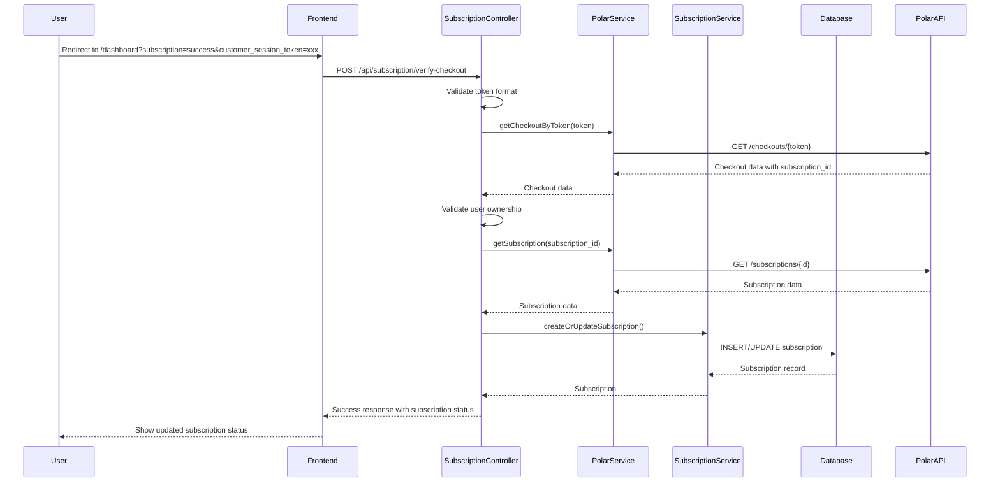

# Design Document: Subscription Checkout Verification

## Overview

Fitur ini menambahkan mekanisme verifikasi subscription setelah user berhasil checkout di Polar.sh. Saat user redirect ke success URL dengan `customer_session_token`, frontend dapat memanggil endpoint verifikasi untuk sync subscription ke database lokal.

Ini berfungsi sebagai fallback ketika webhook dari Polar gagal terkirim atau tidak terproses, memastikan user dapat langsung mengakses fitur premium setelah pembayaran berhasil.

## Architecture



## Components and Interfaces

### 1. SubscriptionController (Modified)

Menambahkan method baru `verifyCheckout` untuk handle verifikasi subscription.

```php
/**
 * Verify subscription after successful checkout.
 * 
 * @param Request $request
 * @return JsonResponse
 */
public function verifyCheckout(Request $request): JsonResponse
```

**Request:**
```json
{
    "customer_session_token": "polar_cst_xxxxx"
}
```

**Success Response (200):**
```json
{
    "success": true,
    "message": "Subscription verified successfully",
    "data": {
        "subscription": {
            "id": 1,
            "plan_name": "standard",
            "status": "active",
            "current_period_end": "2025-01-16T00:00:00Z"
        }
    }
}
```

**Error Responses:**
- 422: INVALID_TOKEN, INVALID_TOKEN_FORMAT
- 401: Unauthenticated
- 403: UNAUTHORIZED_USER
- 500: VERIFICATION_FAILED
- 503: POLAR_CONFIG_MISSING

### 2. PolarService (Modified)

Menambahkan method baru untuk fetch checkout session by token.

```php
/**
 * Get checkout session by customer session token.
 * 
 * @param string $token The customer session token (polar_cst_xxx)
 * @return array|null Checkout data including subscription_id, or null on failure
 */
public function getCheckoutByToken(string $token): ?array
```

**Return Value:**
```php
[
    'id' => 'checkout_id',
    'status' => 'succeeded',
    'subscription_id' => 'sub_xxx',
    'customer_id' => 'cust_xxx',
    'product_id' => 'prod_xxx',
    'metadata' => [
        'user_id' => '1',
        'plan_id' => 'standard'
    ]
]
```

### 3. API Route

```php
// routes/api.php
Route::prefix('subscription')->group(function () {
    // ... existing routes
    Route::post('/verify-checkout', [SubscriptionController::class, 'verifyCheckout']);
});
```

## Data Models

### Existing Models (No Changes Required)

**Subscription Model:**
```php
// app/Models/Subscription.php
// Fields: id, user_id, polar_subscription_id, polar_customer_id, 
//         plan_name, status, current_period_start, current_period_end, cancelled_at
```

### Request Validation

```php
$validator = Validator::make($request->all(), [
    'customer_session_token' => [
        'required',
        'string',
        'regex:/^polar_cst_[a-zA-Z0-9]+$/'
    ],
]);
```

## Correctness Properties

*A property is a characteristic or behavior that should hold true across all valid executions of a system-essentially, a formal statement about what the system should do. Properties serve as the bridge between human-readable specifications and machine-verifiable correctness guarantees.*

### Property 1: Token format validation rejects invalid formats
*For any* string that does not match the pattern `polar_cst_[a-zA-Z0-9]+`, the verification endpoint SHALL return INVALID_TOKEN_FORMAT error.
**Validates: Requirements 2.2**

### Property 2: Successful verification creates subscription record
*For any* valid checkout data from Polar containing subscription_id, customer_id, and product_id, the verification process SHALL result in a subscription record existing in the database with matching polar_subscription_id.
**Validates: Requirements 1.3**

### Property 3: Verification response contains subscription status
*For any* successful verification, the response SHALL contain subscription object with id, plan_name, status, and current_period_end fields.
**Validates: Requirements 1.4**

### Property 4: User ownership validation
*For any* checkout where metadata.user_id differs from authenticated user's id, the verification SHALL return UNAUTHORIZED_USER error.
**Validates: Requirements 3.3**

### Property 5: Idempotent verification
*For any* valid customer_session_token, calling verification N times (where N > 1) SHALL result in exactly one subscription record for the user, and all responses SHALL return the same subscription status.
**Validates: Requirements 5.1, 5.2, 5.3**

### Property 6: Subscription association with authenticated user
*For any* successful verification, the created/updated subscription's user_id SHALL equal the authenticated user's id.
**Validates: Requirements 3.2**

## Error Handling

| Scenario | Error Code | HTTP Status | Message |
|----------|------------|-------------|---------|
| Missing token | INVALID_TOKEN | 422 | Customer session token is required |
| Invalid token format | INVALID_TOKEN_FORMAT | 422 | Invalid token format |
| Polar not configured | POLAR_CONFIG_MISSING | 503 | Subscription service is not configured |
| Checkout not found | VERIFICATION_FAILED | 500 | Failed to verify checkout |
| Subscription not found | VERIFICATION_FAILED | 500 | Failed to fetch subscription details |
| User mismatch | UNAUTHORIZED_USER | 403 | Subscription does not belong to this user |
| Unauthenticated | - | 401 | Unauthenticated |

## Testing Strategy

### Unit Tests

1. **Token Validation Tests**
   - Test empty token returns INVALID_TOKEN
   - Test invalid format returns INVALID_TOKEN_FORMAT
   - Test valid format passes validation

2. **Controller Tests**
   - Test unauthenticated request returns 401
   - Test Polar not configured returns 503
   - Test successful verification flow

3. **PolarService Tests**
   - Test getCheckoutByToken with valid token
   - Test getCheckoutByToken with invalid token returns null
   - Test API error handling

### Property-Based Tests

Using **Pest PHP** with **pest-plugin-faker** for property-based testing.

1. **Property 1 Test**: Generate random strings not matching polar_cst_ pattern, verify all return INVALID_TOKEN_FORMAT
2. **Property 4 Test**: Generate checkout data with random user_ids different from authenticated user, verify all return UNAUTHORIZED_USER
3. **Property 5 Test**: For valid tokens, call verification multiple times and verify subscription count remains 1

### Integration Tests

1. Test full verification flow with mocked Polar API
2. Test subscription creation in database
3. Test subscription update when already exists
