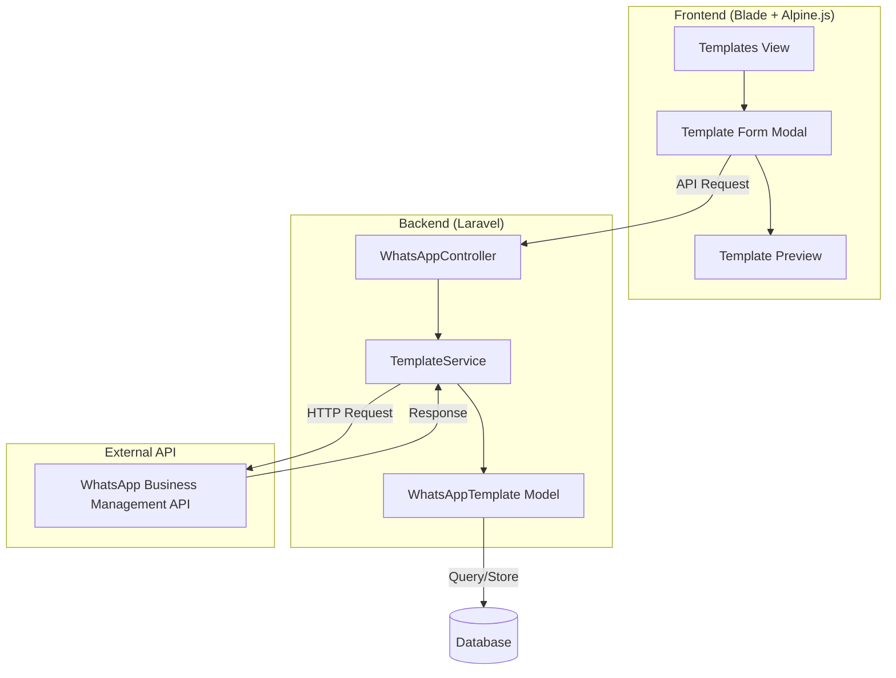

# Design Document

## Overview

Fitur Template Management memperluas kemampuan dashboard WhatsApp yang sudah ada dengan menambahkan operasi CRUD lengkap untuk message templates. Implementasi akan menggunakan arsitektur yang konsisten dengan codebase Laravel yang sudah ada, memanfaatkan WhatsApp Business Management API untuk operasi template, dan menyimpan data secara lokal untuk performa yang optimal.

## Architecture



## Components and Interfaces

### 1. TemplateService (New Service Class)

Service class baru untuk menangani logika bisnis template management.

```php
namespace App\Services;

class TemplateService
{
    /**
     * Create a new template via WhatsApp API
     * @param array $data Template data (name, category, language, components)
     * @return array API response with template_id and status
     */
    public function createTemplate(array $data): array;

    /**
     * Update an existing template via WhatsApp API
     * @param string $templateId Template ID from WhatsApp
     * @param array $data Updated template data
     * @return array API response
     */
    public function updateTemplate(string $templateId, array $data): array;

    /**
     * Delete a template via WhatsApp API
     * @param string $templateName Template name to delete
     * @return array API response
     */
    public function deleteTemplate(string $templateName): array;

    /**
     * Build components array for WhatsApp API
     * @param array $formData Form data from frontend
     * @return array Formatted components array
     */
    public function buildComponents(array $formData): array;

    /**
     * Validate template data before API submission
     * @param array $data Template data to validate
     * @return array Validation result with errors if any
     */
    public function validateTemplateData(array $data): array;
}
```

### 2. WhatsAppController Extensions

Tambahan method pada controller yang sudah ada:

```php
// POST /api/whatsapp/templates
public function createTemplate(Request $request): JsonResponse;

// PUT /api/whatsapp/templates/{id}
public function updateTemplate(Request $request, string $id): JsonResponse;

// DELETE /api/whatsapp/templates/{name}
public function deleteTemplate(string $name): JsonResponse;
```

### 3. Frontend Components (Alpine.js)

```javascript
// Template Manager Alpine Component
function templateManager() {
    return {
        // State
        showCreateModal: boolean,
        showEditModal: boolean,
        showDeleteModal: boolean,
        formData: TemplateFormData,
        errors: ValidationErrors,
        loading: boolean,
        
        // Methods
        openCreateModal(): void,
        openEditModal(template: Template): void,
        openDeleteModal(template: Template): void,
        submitCreate(): Promise<void>,
        submitUpdate(): Promise<void>,
        confirmDelete(): Promise<void>,
        validateForm(): boolean,
        buildPreview(): string,
    }
}
```

## Data Models

### Template Form Data Structure

```typescript
interface TemplateFormData {
    name: string;                    // lowercase, alphanumeric, underscores only
    category: 'MARKETING' | 'UTILITY' | 'AUTHENTICATION';
    language: string;                // e.g., 'en', 'id', 'en_US'
    header?: {
        type: 'TEXT' | 'IMAGE' | 'VIDEO' | 'DOCUMENT';
        text?: string;               // for TEXT type
        example?: string;            // example URL for media types
    };
    body: {
        text: string;                // max 1024 chars
        examples?: string[][];       // example values for variables
    };
    footer?: {
        text: string;                // max 60 chars
    };
    buttons?: Array<{
        type: 'QUICK_REPLY' | 'URL' | 'PHONE_NUMBER';
        text: string;
        url?: string;                // for URL type
        phone_number?: string;       // for PHONE_NUMBER type
    }>;
}
```

### WhatsApp API Request Format

```json
{
    "name": "template_name",
    "category": "MARKETING",
    "language": "en",
    "components": [
        {
            "type": "HEADER",
            "format": "TEXT",
            "text": "Header text"
        },
        {
            "type": "BODY",
            "text": "Body text with {{1}} variable"
        },
        {
            "type": "FOOTER",
            "text": "Footer text"
        },
        {
            "type": "BUTTONS",
            "buttons": [
                {
                    "type": "QUICK_REPLY",
                    "text": "Button text"
                }
            ]
        }
    ]
}
```

### Database Schema (Existing - No Changes Required)

Table `whatsapp_templates` sudah memiliki struktur yang memadai:
- `id`, `whatsapp_account_id`, `template_id`, `name`, `language`
- `category`, `status`, `components` (JSON)
- `body`, `header`, `header_type`, `footer`, `buttons` (JSON)
- `quality_score`, `usage_count`, `timestamps`


## Correctness Properties

*A property is a characteristic or behavior that should hold true across all valid executions of a system-essentially, a formal statement about what the system should do. Properties serve as the bridge between human-readable specifications and machine-verifiable correctness guarantees.*

Based on the acceptance criteria analysis, the following correctness properties have been identified:

### Property 1: Template Name Validation

*For any* string input as template name, the validation function SHALL accept the string if and only if it contains only lowercase letters (a-z), digits (0-9), and underscores (_), and reject all other strings with an appropriate error message.

**Validates: Requirements 1.3, 5.2**

### Property 2: Footer Length Validation

*For any* string input as footer text, the validation function SHALL accept strings with 60 or fewer characters and reject strings exceeding 60 characters with an appropriate error message.

**Validates: Requirements 1.7**

### Property 3: Button Limit Validation

*For any* array of buttons, the validation function SHALL accept configurations with up to 10 quick reply buttons OR up to 2 call-to-action buttons, and reject configurations exceeding these limits.

**Validates: Requirements 1.8**

### Property 4: Body Length Validation

*For any* string input as body text, the validation function SHALL accept strings with 1024 or fewer characters and reject strings exceeding 1024 characters with an appropriate error message.

**Validates: Requirements 5.3**

### Property 5: Required Field Validation

*For any* template form submission, the validation function SHALL reject submissions where required fields (name, category, language, body) are empty and return specific error messages for each missing field.

**Validates: Requirements 5.4**

### Property 6: Variable Sequence Validation

*For any* body text containing variable placeholders, the validation function SHALL warn when variables are not sequential (e.g., {{1}}, {{3}} without {{2}}) and accept properly sequential variables.

**Validates: Requirements 5.5**

### Property 7: Preview Variable Rendering

*For any* template body containing N variable placeholders ({{1}} through {{N}}), the preview function SHALL render exactly N placeholder indicators in the output string.

**Validates: Requirements 4.3**

### Property 8: Template Data Round-Trip

*For any* valid template data object, serializing to JSON for storage and then deserializing back SHALL produce an object equivalent to the original, preserving all component data including nested button configurations.

**Validates: Requirements 6.1, 6.2, 6.3**

## Error Handling

### API Error Handling

| Error Type | HTTP Status | User Message | System Action |
|------------|-------------|--------------|---------------|
| Invalid template name | 400 | "Template name can only contain lowercase letters, numbers, and underscores" | Highlight name field |
| Duplicate template | 400 | "A template with this name already exists" | Highlight name field |
| Invalid category | 400 | "Invalid category selected" | Reset category dropdown |
| Rate limit exceeded | 429 | "Too many requests. Please wait and try again" | Disable submit for 60s |
| Authentication error | 401 | "Session expired. Please login again" | Redirect to login |
| API unavailable | 503 | "WhatsApp service temporarily unavailable" | Show retry button |
| Template not found | 404 | "Template not found or already deleted" | Refresh template list |

### Validation Error Handling

```javascript
// Frontend validation error structure
{
    field: string,           // Field name with error
    message: string,         // User-friendly error message
    type: 'error' | 'warning' // Error severity
}
```

### Error Recovery Strategy

1. **Form State Preservation**: On API error, maintain all user input in the form
2. **Retry Mechanism**: For transient errors (5xx), provide retry button
3. **Graceful Degradation**: If API is unavailable, allow viewing cached templates
4. **Error Logging**: Log all API errors with request/response details for debugging

## Testing Strategy

### Dual Testing Approach

This feature will use both unit tests and property-based tests to ensure comprehensive coverage:

- **Unit Tests**: Verify specific examples, edge cases, and integration points
- **Property-Based Tests**: Verify universal properties that should hold across all inputs

### Property-Based Testing Framework

**Framework**: PHPUnit with `spatie/phpunit-snapshot-assertions` for data comparison, custom generators for template data.

For PHP property-based testing, we will use a custom implementation with random data generators since PHP lacks a mature PBT library like QuickCheck. Each property test will run 100 iterations with randomly generated inputs.

### Test Categories

#### 1. Unit Tests

- Template name validation with specific valid/invalid examples
- API request formatting
- Error response handling
- Database operations (CRUD)

#### 2. Property-Based Tests

Each correctness property will have a corresponding property-based test:

| Property | Test Description | Generator |
|----------|------------------|-----------|
| Property 1 | Template name validation | Random strings with various character sets |
| Property 2 | Footer length validation | Random strings of varying lengths |
| Property 3 | Button limit validation | Random button arrays of varying sizes |
| Property 4 | Body length validation | Random strings of varying lengths |
| Property 5 | Required field validation | Random template objects with missing fields |
| Property 6 | Variable sequence validation | Random body texts with variable patterns |
| Property 7 | Preview variable rendering | Random templates with 0-10 variables |
| Property 8 | Template data round-trip | Random valid template objects |

### Test File Structure

```
tests/
├── Unit/
│   └── Services/
│       └── TemplateServiceTest.php
└── Property/
    └── Services/
        └── TemplateServicePropertyTest.php
```

### Property Test Implementation Pattern

```php
/**
 * Feature: template-management, Property 1: Template Name Validation
 * Validates: Requirements 1.3, 5.2
 */
public function test_template_name_validation_property(): void
{
    for ($i = 0; $i < 100; $i++) {
        $name = $this->generateRandomString();
        $result = $this->service->validateTemplateName($name);
        
        $isValid = preg_match('/^[a-z0-9_]+$/', $name) === 1;
        $this->assertEquals($isValid, $result['valid']);
    }
}
```
