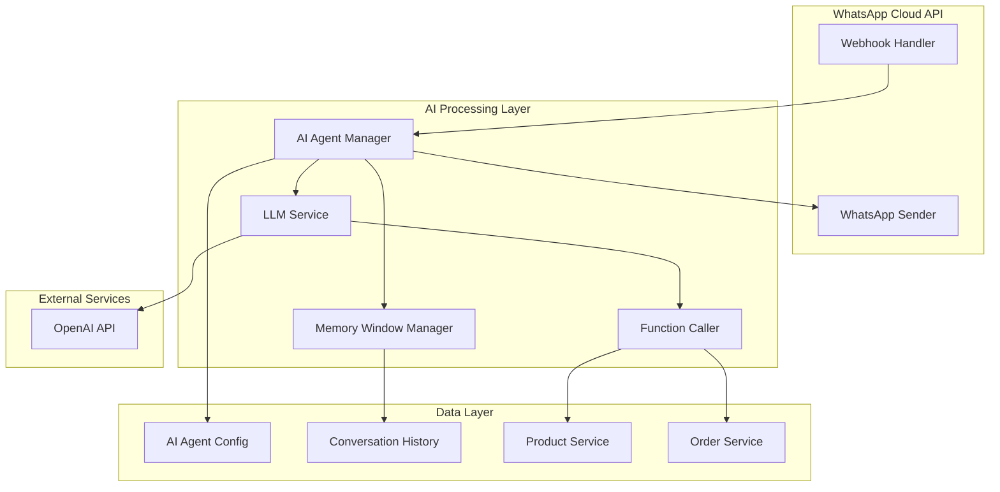
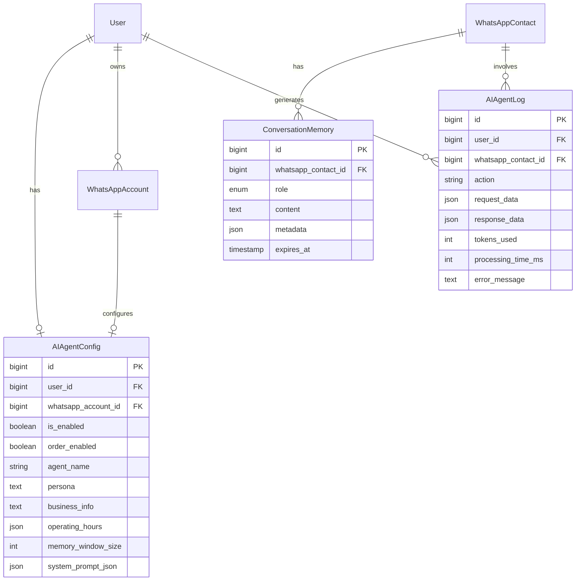

# Design Document: WhatsApp AI Agent

## Overview

Fitur WhatsApp AI Agent menyediakan kemampuan chatbot otomatis yang terintegrasi dengan nomor WABA (WhatsApp Business Account) pengguna. Sistem ini memungkinkan bisnis untuk mengkonfigurasi AI chatbot yang dapat menjawab pertanyaan customer, memberikan informasi produk, dan memproses order melalui WhatsApp.

Arsitektur sistem dibangun di atas infrastruktur WhatsApp yang sudah ada, dengan penambahan layer AI processing yang menggunakan LLM (Large Language Model) untuk menghasilkan respons cerdas. Sistem mendukung function calling untuk mengakses data produk dan membuat order melalui integrasi dengan POS system.

## Architecture



### Component Flow

1. **Incoming Message**: WhatsApp webhook menerima pesan dari customer
2. **AI Agent Check**: Sistem memeriksa apakah AI Agent aktif untuk akun tersebut
3. **Context Building**: Memory Window Manager mengambil riwayat percakapan
4. **LLM Processing**: Pesan dikirim ke LLM dengan system prompt dan context
5. **Function Calling**: Jika diperlukan, LLM memanggil fungsi untuk akses data
6. **Response Generation**: LLM menghasilkan respons berdasarkan context dan data
7. **Message Delivery**: Respons dikirim kembali ke customer via WhatsApp

## Components and Interfaces

### 1. AIAgentConfig Model

Model untuk menyimpan konfigurasi AI Agent per user.

```php
// app/Models/AIAgentConfig.php
class AIAgentConfig extends Model
{
    protected $fillable = [
        'user_id',
        'whatsapp_account_id',
        'is_enabled',
        'order_enabled',
        'agent_name',
        'persona',
        'business_info',
        'operating_hours',
        'memory_window_size',
        'system_prompt_json',
    ];
    
    protected $casts = [
        'is_enabled' => 'boolean',
        'order_enabled' => 'boolean',
        'operating_hours' => 'array',
        'memory_window_size' => 'integer',
    ];
}
```

### 2. ConversationMemory Model

Model untuk menyimpan riwayat percakapan per contact.

```php
// app/Models/ConversationMemory.php
class ConversationMemory extends Model
{
    protected $fillable = [
        'whatsapp_contact_id',
        'role',        // 'user' or 'assistant'
        'content',
        'metadata',
        'expires_at',
    ];
    
    protected $casts = [
        'metadata' => 'array',
        'expires_at' => 'datetime',
    ];
}
```

### 3. AIAgentService

Service utama untuk mengelola AI Agent operations.

```php
// app/Services/AIAgentService.php
interface AIAgentServiceInterface
{
    public function getConfig(int $userId): ?AIAgentConfig;
    public function updateConfig(int $userId, array $data): AIAgentConfig;
    public function isEnabled(int $userId): bool;
    public function processMessage(WhatsAppMessage $message, WhatsAppAccount $account): ?string;
    public function buildSystemPrompt(AIAgentConfig $config): string;
}
```

### 4. LLMService

Service untuk komunikasi dengan LLM provider.

```php
// app/Services/LLMService.php
interface LLMServiceInterface
{
    public function chat(array $messages, array $functions = []): LLMResponse;
    public function chatWithFunctions(array $messages, array $functions): LLMResponse;
}

class LLMResponse
{
    public string $content;
    public ?array $functionCall;
    public string $finishReason;
}
```

### 5. FunctionCallerService

Service untuk mengeksekusi function calls dari LLM.

```php
// app/Services/FunctionCallerService.php
interface FunctionCallerServiceInterface
{
    public function execute(string $functionName, array $arguments, int $userId): mixed;
    public function getAvailableFunctions(bool $orderEnabled): array;
}
```

### 6. MemoryWindowService

Service untuk mengelola conversation memory.

```php
// app/Services/MemoryWindowService.php
interface MemoryWindowServiceInterface
{
    public function getConversationHistory(int $contactId, int $windowSize): array;
    public function addMessage(int $contactId, string $role, string $content): ConversationMemory;
    public function clearExpiredMemories(): int;
    public function shouldStartNewConversation(int $contactId): bool;
}
```

### 7. AIAgentController

Controller untuk API endpoints.

```php
// app/Http/Controllers/Api/AIAgentController.php
class AIAgentController extends Controller
{
    public function getConfig(Request $request);
    public function updateConfig(Request $request);
    public function toggleEnabled(Request $request);
    public function toggleOrderEnabled(Request $request);
}
```

## Data Models

### Database Schema

```sql
-- AI Agent Configuration Table
CREATE TABLE ai_agent_configs (
    id BIGINT UNSIGNED AUTO_INCREMENT PRIMARY KEY,
    user_id BIGINT UNSIGNED NOT NULL,
    whatsapp_account_id BIGINT UNSIGNED NOT NULL,
    is_enabled BOOLEAN DEFAULT FALSE,
    order_enabled BOOLEAN DEFAULT FALSE,
    agent_name VARCHAR(255) NOT NULL,
    persona TEXT,
    business_info TEXT,
    operating_hours JSON,
    memory_window_size INT DEFAULT 10,
    system_prompt_json JSON,
    created_at TIMESTAMP NULL,
    updated_at TIMESTAMP NULL,
    
    FOREIGN KEY (user_id) REFERENCES users(id) ON DELETE CASCADE,
    FOREIGN KEY (whatsapp_account_id) REFERENCES whatsapp_accounts(id) ON DELETE CASCADE,
    UNIQUE KEY unique_user_whatsapp (user_id, whatsapp_account_id)
);

-- Conversation Memory Table
CREATE TABLE conversation_memories (
    id BIGINT UNSIGNED AUTO_INCREMENT PRIMARY KEY,
    whatsapp_contact_id BIGINT UNSIGNED NOT NULL,
    role ENUM('user', 'assistant', 'system', 'function') NOT NULL,
    content TEXT NOT NULL,
    metadata JSON,
    expires_at TIMESTAMP NULL,
    created_at TIMESTAMP NULL,
    updated_at TIMESTAMP NULL,
    
    FOREIGN KEY (whatsapp_contact_id) REFERENCES whatsapp_contacts(id) ON DELETE CASCADE,
    INDEX idx_contact_expires (whatsapp_contact_id, expires_at)
);

-- AI Agent Activity Log Table
CREATE TABLE ai_agent_logs (
    id BIGINT UNSIGNED AUTO_INCREMENT PRIMARY KEY,
    user_id BIGINT UNSIGNED NOT NULL,
    whatsapp_contact_id BIGINT UNSIGNED,
    action VARCHAR(50) NOT NULL,
    request_data JSON,
    response_data JSON,
    tokens_used INT,
    processing_time_ms INT,
    error_message TEXT,
    created_at TIMESTAMP NULL,
    
    FOREIGN KEY (user_id) REFERENCES users(id) ON DELETE CASCADE,
    INDEX idx_user_created (user_id, created_at)
);
```

### Entity Relationship Diagram




## Correctness Properties

*A property is a characteristic or behavior that should hold true across all valid executions of a system-essentially, a formal statement about what the system should do. Properties serve as the bridge between human-readable specifications and machine-verifiable correctness guarantees.*

Based on the prework analysis, the following correctness properties have been identified. Redundant properties have been consolidated where one property implies another.

### Property 1: Configuration Round-Trip Consistency

*For any* valid AI Agent configuration, serializing it to JSON and then deserializing it back SHALL produce an equivalent configuration object.

**Validates: Requirements 1.4, 1.5**

### Property 2: Required Field Validation

*For any* AI Agent configuration with empty agent_name or empty persona, the system SHALL reject the save operation and return a validation error.

**Validates: Requirements 1.3**

### Property 3: Order Function Availability Based on Toggle

*For any* AI Agent configuration, when order_enabled is true, the available functions SHALL include get_products, create_order, and get_order_status. When order_enabled is false, these functions SHALL NOT be available.

**Validates: Requirements 2.1, 2.2**

### Property 4: State Persistence Consistency

*For any* toggle operation (is_enabled or order_enabled), immediately retrieving the configuration after the toggle SHALL return the new state value.

**Validates: Requirements 2.4**

### Property 5: Conditional Message Processing

*For any* incoming WhatsApp message, the AI Agent SHALL process the message if and only if is_enabled is true for the associated WhatsApp account.

**Validates: Requirements 3.1, 3.5, 8.1, 8.2**

### Property 6: System Prompt Inclusion

*For any* message processed by the AI Agent, the LLM request SHALL include the configured system prompt built from agent_name, persona, business_info, and operating_hours.

**Validates: Requirements 3.2**

### Property 7: Memory Window Size Enforcement

*For any* conversation with a contact, the number of messages in the memory window SHALL never exceed the configured memory_window_size.

**Validates: Requirements 4.2, 4.3**

### Property 8: Memory Chronological Ordering

*For any* retrieval of conversation history, the messages SHALL be ordered chronologically from oldest to newest (ascending by created_at).

**Validates: Requirements 4.4**

### Property 9: Memory Expiration

*For any* conversation where the last message is older than 24 hours, retrieving conversation history SHALL return an empty array (fresh start).

**Validates: Requirements 4.5**

### Property 10: Product Information Completeness

*For any* product retrieved by the AI Agent, the returned data SHALL include name, price, description, and stock_quantity fields.

**Validates: Requirements 5.2**

### Property 11: Stock Availability Accuracy

*For any* product with stock_quantity equal to 0, the AI Agent SHALL report the product as unavailable.

**Validates: Requirements 5.3**

### Property 12: Order Stock Validation

*For any* order creation request, if any requested product has insufficient stock, the system SHALL reject the order and identify the unavailable products.

**Validates: Requirements 6.2, 6.4**

### Property 13: Order Confirmation Content

*For any* successfully created order, the confirmation message SHALL contain the order_number and total amount.

**Validates: Requirements 6.3**

### Property 14: Order Contact Association

*For any* order created through the AI Agent, the order SHALL be associated with the WhatsApp contact who placed it.

**Validates: Requirements 6.5**

### Property 15: Status Change Audit Logging

*For any* change to is_enabled status, the system SHALL create an audit log entry with the user_id, action, and timestamp.

**Validates: Requirements 8.4**

### Property 16: Response Length Truncation

*For any* LLM response exceeding 4096 characters, the system SHALL truncate the response to at most 4096 characters before sending via WhatsApp.

**Validates: Requirements 9.4**

### Property 17: Retry Behavior on LLM Failure

*For any* LLM API call that fails, the system SHALL retry up to 3 times before returning a fallback message.

**Validates: Requirements 9.3**

## Error Handling

### Error Categories

1. **Configuration Errors**
   - Missing required fields (agent_name, persona)
   - Invalid JSON format in system_prompt_json
   - WhatsApp account not connected

2. **LLM Service Errors**
   - API timeout (> 30 seconds)
   - Rate limiting (429 response)
   - Invalid API key
   - Service unavailable

3. **Function Execution Errors**
   - Product not found
   - Insufficient stock
   - Order creation failure
   - Database connection errors

4. **WhatsApp Delivery Errors**
   - Message too long
   - Invalid recipient
   - Token expired

### Error Response Strategy

```php
class AIAgentErrorHandler
{
    const FALLBACK_MESSAGE = "Maaf, saya sedang mengalami kendala teknis. Silakan coba lagi dalam beberapa saat atau hubungi kami langsung.";
    
    public function handleError(Throwable $e, WhatsAppContact $contact): string
    {
        Log::error('AI Agent Error', [
            'contact_id' => $contact->id,
            'error' => $e->getMessage(),
            'trace' => $e->getTraceAsString(),
        ]);
        
        return self::FALLBACK_MESSAGE;
    }
}
```

### Retry Configuration

```php
// config/ai-agent.php
return [
    'llm' => [
        'provider' => env('AI_AGENT_LLM_PROVIDER', 'openai'),
        'api_key' => env('OPENAI_API_KEY'),
        'model' => env('AI_AGENT_MODEL', 'gpt-4o-mini'),
        'max_tokens' => 1000,
        'temperature' => 0.7,
        'timeout' => 30,
        'retry' => [
            'times' => 3,
            'sleep' => 1000, // milliseconds, will use exponential backoff
        ],
    ],
    'memory' => [
        'default_window_size' => 10,
        'expiration_hours' => 24,
    ],
    'whatsapp' => [
        'max_message_length' => 4096,
    ],
];
```

## Testing Strategy

### Dual Testing Approach

This feature requires both unit tests and property-based tests to ensure comprehensive coverage:

- **Unit tests** verify specific examples, edge cases, and integration points
- **Property-based tests** verify universal properties that should hold across all inputs

### Property-Based Testing Framework

The project will use **PHPUnit with Eris** for property-based testing in PHP. Eris is a porting of QuickCheck and Hypothesis to PHP.

```bash
composer require giorgiosironi/eris --dev
```

### Test Structure

```
tests/
├── Unit/
│   ├── Services/
│   │   ├── AIAgentServiceTest.php
│   │   ├── LLMServiceTest.php
│   │   ├── FunctionCallerServiceTest.php
│   │   └── MemoryWindowServiceTest.php
│   ├── Models/
│   │   ├── AIAgentConfigPropertyTest.php
│   │   └── ConversationMemoryPropertyTest.php
│   └── Controllers/
│       └── AIAgentControllerTest.php
├── Feature/
│   └── AIAgentIntegrationTest.php
```

### Property-Based Test Requirements

Each property-based test MUST:
1. Be tagged with a comment referencing the correctness property: `**Feature: whatsapp-ai-agent, Property {number}: {property_text}**`
2. Run a minimum of 100 iterations
3. Use smart generators that constrain to valid input space
4. Reference the specific requirements being validated

### Example Property Test

```php
/**
 * **Feature: whatsapp-ai-agent, Property 1: Configuration Round-Trip Consistency**
 * **Validates: Requirements 1.4, 1.5**
 */
public function testConfigurationRoundTrip(): void
{
    $this->forAll(
        Generator\associative([
            'agent_name' => Generator\string(),
            'persona' => Generator\string(),
            'business_info' => Generator\string(),
            'operating_hours' => Generator\associative([
                'monday' => Generator\string(),
                'tuesday' => Generator\string(),
            ]),
        ])
    )
    ->withMaxSize(100)
    ->then(function ($config) {
        $json = json_encode($config);
        $decoded = json_decode($json, true);
        
        $this->assertEquals($config, $decoded);
    });
}
```

### Unit Test Coverage

Unit tests should cover:
- Configuration CRUD operations
- LLM service mocking and response handling
- Function caller execution paths
- Memory window management
- Error handling scenarios
- API endpoint responses

