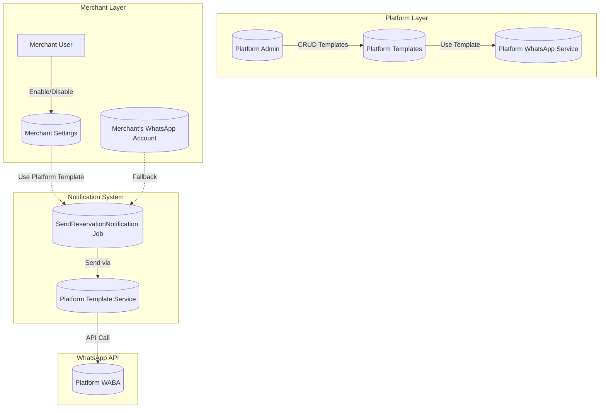
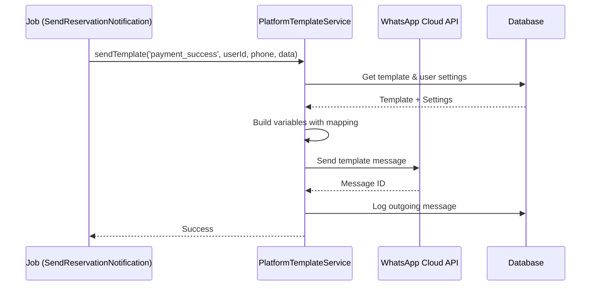

# Fitur Platform WhatsApp Template - Rencana Implementasi

## 1. Latar Belakang Masalah

### Masalah Saat Ini
- Pesan WhatsApp teks hanya bisa dikirim dalam window 24 jam sejak customer terakhir membalas
- Di luar window 24 jam, harus menggunakan WhatsApp Template yang sudah di-approve Meta
- Setiap merchant memiliki WABA (WhatsApp Business Account) sendiri dengan template masing-masing
- Tidak ada standarisasi template pembayaran berhasil antar merchant

### Solusi yang Diusulkan
Membuat **Platform WhatsApp Template** - sistem template terpusat yang:
1. Dikelola oleh platform admin
2. Bisa digunakan oleh semua merchant
3. Dikirim menggunakan credentials platform (bukan merchant)
4. Merchant bisa enable/disable dan kustomisasi variabel

---

## 2. Arsitektur Sistem



---

## 3. Struktur Database

### 3.1 Tabel: `platform_whatsapp_templates`

Tabel utama untuk menyimpan template yang dikelola platform.

```php
Schema::create('platform_whatsapp_templates', function (Blueprint $table) {
    $table->id();
    $table->string('template_key')->unique(); // 'payment_success', 'reservation_confirmation', dll
    $table->string('name'); // Nama tampilan untuk admin
    $table->string('description')->nullable(); // Deskripsi template
    $table->string('language')->default('id'); // Bahasa template
    $table->string('category')->default('TRANSACTIONAL'); // Kategori template
    $table->string('whatsapp_template_name'); // Nama template di WhatsApp Business
    $table->text('body_template'); // Template body dengan placeholder {{variable}}
    $table->json('variables'); // Definisi variabel: [{"name": "customer_name", "type": "text", "required": true}]
    $table->string('header_type')->nullable(); // 'text', 'image', 'video', 'document'
    $table->text('header_content')->nullable(); // Konten header
    $table->string('footer')->nullable(); // Footer text
    $table->json('buttons')->nullable(); // Konfigurasi tombol
    $table->enum('status', ['active', 'inactive', 'pending_approval'])->default('active');
    $table->boolean('is_global')->default(true); // Apakah bisa dikustomisasi
    $table->timestamps();
    
    $table->index('template_key');
    $table->index('status');
});
```

### 3.2 Tabel: `user_platform_template_settings`

Pengaturan per merchant untuk platform template.

```php
Schema::create('user_platform_template_settings', function (Blueprint $table) {
    $table->id();
    $table->foreignId('user_id')->constrained()->onDelete('cascade');
    $table->foreignId('platform_whatsapp_template_id')->constrained()->onDelete('cascade');
    $table->boolean('is_enabled')->default(true); // Enable/disable template
    $table->json('variable_mapping')->nullable(); // Mapping variabel kustom
    // Contoh: {"customer_name": "reservation.customer_name", "order_id": "reservation.order_id"}
    $table->string('custom_footer')->nullable(); // Footer kustom (jika diizinkan)
    $table->timestamps();
    
    $table->unique(['user_id', 'platform_whatsapp_template_id']);
});
```

---

## 4. Variabel Template

### 4.1 Definisi Variabel Standar

```php
// Variabel yang tersedia untuk payment_success template
$variables = [
    [
        'key' => 'customer_name',
        'label' => 'Nama Customer',
        'type' => 'text',
        'required' => true,
        'source' => 'reservation.customer_name',
        'example' => 'Budi Santoso'
    ],
    [
        'key' => 'order_id',
        'label' => 'Order ID',
        'type' => 'text',
        'required' => true,
        'source' => 'reservation.order_id',
        'example' => 'RSV-20260220-001'
    ],
    [
        'key' => 'reservation_date',
        'label' => 'Tanggal Reservasi',
        'type' => 'text',
        'required' => true,
        'source' => 'reservation.reservation_date',
        'example' => '20 Feb 2026'
    ],
    [
        'key' => 'reservation_time',
        'label' => 'Waktu Reservasi',
        'type' => 'text',
        'required' => true,
        'source' => 'reservation.reservation_time',
        'example' => '19:00'
    ],
    [
        'key' => 'guest_count',
        'label' => 'Jumlah Tamu',
        'type' => 'text',
        'required' => true,
        'source' => 'reservation.guest_count',
        'example' => '4 orang'
    ],
    [
        'key' => 'total_amount',
        'label' => 'Total Pembayaran',
        'type' => 'currency',
        'required' => true,
        'source' => 'reservation.total_amount',
        'example' => 'Rp 500.000'
    ],
    [
        'key' => 'paid_amount',
        'label' => 'Jumlah Dibayar',
        'type' => 'currency',
        'required' => true,
        'source' => 'reservation.paid_amount',
        'example' => 'Rp 250.000'
    ],
    [
        'key' => 'merchant_name',
        'label' => 'Nama Merchant',
        'type' => 'text',
        'required' => true,
        'source' => 'user.name',
        'example' => 'Restoran Saya'
    ]
];
```

### 4.2 Contoh Template Body

```
✅ Pembayaran Berhasil!

Hai {{customer_name}}, reservasi Anda telah dikonfirmasi.

📋 Detail Reservasi:
Order ID: {{order_id}}
Tanggal: {{reservation_date}} pukul {{reservation_time}}
Jumlah Tamu: {{guest_count}}

💰 Pembayaran:
Total: {{total_amount}}
Dibayar: {{paid_amount}}

Terima kasih telah memesan di {{merchant_name}}!
```

---

## 5. Struktur API

### 5.1 Platform Admin Endpoints

```
POST   /api/admin/platform-templates              - Buat template baru
GET    /api/admin/platform-templates              - List semua template
GET    /api/admin/platform-templates/{id}         - Detail template
PUT    /api/admin/platform-templates/{id}         - Update template
DELETE /api/admin/platform-templates/{id}         - Hapus template
POST   /api/admin/platform-templates/{id}/sync    - Sync ke WhatsApp API
```

### 5.2 Merchant Endpoints

```
GET    /api/platform-templates                    - List template yang tersedia untuk merchant
GET    /api/platform-templates/{id}                - Detail template
PUT    /api/platform-templates/{id}/settings      - Update pengaturan merchant
GET    /api/platform-templates/{id}/preview       - Preview dengan data sample
```

### 5.3 Penggunaan di Job

```php
// Di SendReservationNotification.php
public function handle(
    WhatsAppAccountService $whatsappService,
    PlatformTemplateService $platformTemplateService
): void {
    // Cek apakah merchant menggunakan platform template
    $usePlatformTemplate = $this->shouldUsePlatformTemplate();
    
    if ($usePlatformTemplate) {
        // Kirim menggunakan platform template
        $platformTemplateService->sendTemplate(
            templateKey: 'payment_success',
            userId: $this->reservation->user_id,
            recipientPhone: $customerPhone,
            variables: $this->buildTemplateVariables()
        );
    } else {
        // Fallback ke cara lama (text message)
        $this->sendTextMessage(...);
    }
}
```

---

## 6. Service Layer

### 6.1 PlatformTemplateService

```php
class PlatformTemplateService
{
    /**
     * Kirim template menggunakan credentials platform
     */
    public function sendTemplate(
        string $templateKey,
        int $userId,
        string $recipientPhone,
        array $variables
    ): SendResult;
    
    /**
     * Cek apakah user menggunakan platform template
     */
    public function isEnabledForUser(int $userId, string $templateKey): bool;
    
    /**
     * Get template dengan variable mapping untuk user tertentu
     */
    public function getTemplateForUser(int $userId, string $templateKey): ?PlatformTemplate;
    
    /**
     * Build variables dengan mapping kustom user
     */
    public function buildVariables(int $userId, string $templateKey, array $data): array;
    
    /**
     * Preview template dengan sample data
     */
    public function preview(string $templateKey, array $variables): string;
}
```

---

## 7. Alur Kerja Backend

### 7.1 Kirim Notifikasi Pembayaran Berhasil



### 7.2 Fallback Logic

```php
// Jika platform template gagal, fallback ke text message
try {
    $result = $platformTemplateService->sendTemplate(...);
} catch (PlatformTemplateException $e) {
    Log::warning('Platform template failed, falling back to text message', [
        'error' => $e->getMessage(),
        'reservation_id' => $this->reservation->id
    ]);
    
    // Kirim text message (akan gagal di luar 24 jam window)
    // tapi setidaknya mencoba...
    $this->sendTextMessageFallback();
}
```

---

## 8. Fitur Frontend

### 8.1 Halaman Pengaturan Template (Merchant)

- **List Template**: Tampilkan semua platform templates yang tersedia
- **Toggle Enable/Disable**: Switch untuk mengaktifkan/nonaktifkan template
- **Preview**: Lihat preview pesan dengan data sample
- **Variable Mapping** (opsional): Jika diizinkan, mapping variabel kustom

### 8.2 Mockup UI

```
┌─────────────────────────────────────────────────────────────┐
│ 📱 Platform Templates                              [Admin]  │
├─────────────────────────────────────────────────────────────┤
│                                                             │
│ ┌─────────────────────────────────────────────────────────┐ │
│ │ ✅ Pembayaran Berhasil                                   │ │
│ │    Template Key: payment_success                        │ │
│ │    Status: Aktif                    [Toggle: ON]        │ │
│ │    Variabel: customer_name, order_id, dll              │ │
│ │                                                         │ │
│ │    [👁 Preview]  [⚙ Settings]  [📊 Usage]             │ │
│ └─────────────────────────────────────────────────────────┘ │
│                                                             │
│ ┌─────────────────────────────────────────────────────────┐ │
│ │ 📅 Konfirmasi Reservasi                                 │ │
│ │    Template Key: reservation_confirmation               │ │
│ │    Status: Aktif                    [Toggle: ON]       │ │
│ │    [👁 Preview]  [⚙ Settings]                         │ │
│ └─────────────────────────────────────────────────────────┘ │
│                                                             │
└─────────────────────────────────────────────────────────────┘
```

---

## 9. Langkah Implementasi

### Fase 1: Database & Model
1. Buat migration untuk `platform_whatsapp_templates`
2. Buat migration untuk `user_platform_template_settings`
3. Buat model `PlatformWhatsAppTemplate`
4. Buat model `UserPlatformTemplateSetting`

### Fase 2: Platform Admin Features
1. Buat API endpoints CRUD untuk platform templates
2. Buat seeder untuk template awal (payment_success)
3. Validasi template body untuk format variabel

### Fase 3: Service Layer
1. Buat `PlatformTemplateService`
2. Integrasi dengan WhatsApp Cloud API
3. Handle variable mapping
4. Logging & error handling

### Fase 4: Merchant Features
1. Buat API endpoints untuk merchant
2. Enable/disable functionality
3. Preview functionality

### Fase 5: Integration
1. Modifikasi `SendReservationNotification` job
2. Tambahkan fallback logic
3. Testing end-to-end

### Fase 6: Frontend
1. Halaman list platform templates untuk merchant
2. Preview modal
3. Toggle enable/disable

---

## 10. Catatan Penting

1. **WhatsApp Template Approval**: Template harus di-approve dulu di Facebook Business Manager sebelum bisa digunakan
2. **Credentials Platform**: Pastikan `WHATSAPP_ACCESS_TOKEN` dan `WHATSAPP_BUSINESS_ACCOUNT_ID` sudah dikonfigurasi di `.env`
3. **Rate Limiting**: WhatsApp API memiliki rate limits, perlu dihandle dengan proper queue
4. **Fallback**: Selalu ada fallback ke text message jika template gagal
5. **Logging**: Semua pengiriman template harus di-log untuk debugging
