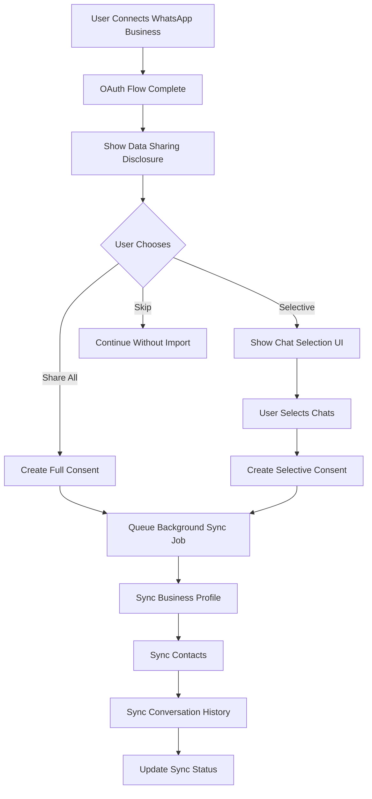

# WhatsApp Data Sharing & Import Architecture

## Overview

This document outlines the architecture for implementing WhatsApp Business data sharing capabilities, allowing users to import their contacts and conversation history when connecting via WhatsApp Business integration (Coexistence mode).

## Current System State

### Existing Components
- **WhatsAppAccount**: Stores WhatsApp Business account credentials
- **WhatsAppContact**: Stores imported contacts with phone numbers and profile info
- **WhatsAppMessage**: Stores conversation messages (incoming/outgoing)
- **EmbeddedSignupController**: Handles OAuth connection flow
- **WhatsAppFlowService**: Manages WhatsApp Flows creation

### Current Limitations
- No explicit consent tracking for data sharing
- No user control over which chats to import
- No transparency UI showing what data will be shared
- No mechanism to selectively import conversations

---

## Architecture Components

### 1. Database Layer

#### New Table: `whatsapp_data_sharing_consents`
```sql
CREATE TABLE whatsapp_data_sharing_consents (
    id BIGSERIAL PRIMARY KEY,
    user_id BIGINT NOT NULL REFERENCES users(id) ON DELETE CASCADE,
    whatsapp_account_id BIGINT NOT NULL REFERENCES whatsapp_accounts(id) ON DELETE CASCADE,
    
    -- Consent Flags
    business_profile_shared BOOLEAN DEFAULT FALSE,
    contacts_shared BOOLEAN DEFAULT FALSE,
    conversation_history_shared BOOLEAN DEFAULT FALSE,
    
    -- Conversation Selection (if user chooses selective import)
    selected_contact_ids JSONB DEFAULT '[]',  -- Array of WhatsApp contact IDs to import
    excluded_contact_ids JSONB DEFAULT '[]',  -- Array of contacts to exclude
    
    -- Time Range
    conversation_months INTEGER DEFAULT 6,  -- 1-6 months
    
    -- Consent Metadata
    consent_given_at TIMESTAMP WITH TIME ZONE,
    consent_updated_at TIMESTAMP WITH TIME ZONE,
    ip_address VARCHAR(45),
    user_agent TEXT,
    
    -- Status
    status VARCHAR(20) DEFAULT 'pending',  -- pending, active, revoked
    synced_at TIMESTAMP WITH TIME ZONE,
    
    created_at TIMESTAMP WITH TIME ZONE DEFAULT NOW(),
    updated_at TIMESTAMP WITH TIME ZONE DEFAULT NOW()
);

CREATE INDEX idx_consents_user_account ON whatsapp_data_sharing_consents(user_id, whatsapp_account_id);
CREATE INDEX idx_consents_status ON whatsapp_data_sharing_consents(status);
```

#### Extended Table: `whatsapp_accounts`
Add new columns for coexistence settings:
```sql
ALTER TABLE whatsapp_accounts ADD COLUMN coexistence_enabled BOOLEAN DEFAULT FALSE;
ALTER TABLE whatsapp_accounts ADD COLUMN data_sync_settings JSONB;
ALTER TABLE whatsapp_accounts ADD COLUMN last_data_sync_at TIMESTAMP WITH TIME ZONE;
ALTER TABLE whatsapp_accounts ADD COLUMN data_sync_status VARCHAR(20) DEFAULT 'idle';  -- idle, syncing, completed, failed
```

---

### 2. Service Layer

#### New: `WhatsAppDataSyncService`
Responsible for:
- Fetching data from WhatsApp Business API
- Syncing contacts from WhatsApp Business App
- Importing conversation history (up to 6 months)
- Background processing with queuing

#### New: `WhatsAppConsentService`
Responsible for:
- Managing user consent for data sharing
- Storing consent preferences
- Generating transparency disclosures
- Revoking consent

---

### 3. API Endpoints

#### Consent Management
```
GET    /api/whatsapp/data-sharing/info          # Get data sharing disclosure info
POST   /api/whatsapp/data-sharing/consent        # Submit consent with preferences
GET    /api/whatsapp/data-sharing/status          # Get current consent status
PUT    /api/whatsapp/data-sharing/consent         # Update consent preferences
DELETE /api/whatsapp/data-sharing/consent        # Revoke consent
```

#### Chat Selection
```
GET    /api/whatsapp/contacts/preview            # Get contacts available for import (with message counts)
POST   /api/whatsapp/data-sharing/validate-selection  # Validate selected contacts before import
```

#### Sync Status
```
GET    /api/whatsapp/data-sharing/sync-status    # Get sync progress
POST   /api/whatsapp/data-sharing/sync            # Trigger manual sync
GET    /api/whatsapp/data-sharing/sync-log         # Get sync history
```

---

### 4. Data Flow



---

### 5. Transparency & Disclosure UI

#### What Users Will See (Frontend)

**Step 1: Data Sharing Disclosure**
```
┌─────────────────────────────────────────────┐
│  📤 Share Your WhatsApp Business Data       │
├─────────────────────────────────────────────┤
│                                             │
│  To help us serve you better, we can import │
│  the following from your WhatsApp Business │
│  account:                                   │
│                                             │
│  ☑ Business Profile Information            │
│     Your business name, description, and   │
│     contact info that you've set up        │
│                                             │
│  ☑ Contact List                             │
│     All customers who've messaged you      │
│     (names and phone numbers)              │
│                                             │
│  ☑ Conversation History (Last 6 months)    │
│     All messages exchanged with customers   │
│                                             │
│  ─────────────────────────────────────────  │
│                                             │
│  ⚠️ Important:                              │
│  • You can choose which chats to import    │
│  • You can revoke access anytime           │
│  • Your data stays secure and private      │
│                                             │
│  [ Skip for Now ]  [ Continue ]             │
└─────────────────────────────────────────────┘
```

**Step 2: Chat Selection (Optional)**
```
┌─────────────────────────────────────────────┐
│  💬 Select Conversations to Import         │
├─────────────────────────────────────────────┤
│                                             │
│  Search: [________________]                  │
│                                             │
│  Sort by: [Most Recent ▼]                   │
│                                             │
│  ☑ Select All (245 chats)                   │
│  ─────────────────────────────────────────  │
│  ☑ 👤 John Doe          +1 555-123-4567   │
│     Last message: 2 hours ago    📝 45    │
│  ☑ 👤 Jane Smith        +1 555-987-6543   │
│     Last message: Yesterday       📝 120   │
│  ☐ 👤 Acme Corp          +1 555-000-0000   │
│     Last message: 3 days ago       📝 8     │
│  ...                                        │
│                                             │
│  Selected: 244 chats                        │
│  ─────────────────────────────────────────  │
│  [ Import Selected ]                        │
└─────────────────────────────────────────────┘
```

---

### 6. Background Processing

#### New Job: `SyncWhatsAppDataJob`
- Implements `ShouldQueue`
- Processes data sync in chunks
- Tracks progress and provides status updates
- Handles errors gracefully with retry logic

```php
class SyncWhatsAppDataJob implements ShouldQueue
{
    public int $tries = 3;
    public int $timeout = 3600; // 1 hour
    
    public function handle(WhatsAppDataSyncService $syncService): void
    {
        // 1. Sync business profile
        // 2. Sync contacts
        // 3. Sync conversations (in batches)
        // 4. Update sync status
    }
}
```

---

### 7. Security & Privacy

1. **Consent Tracking**: All data sharing must be explicitly consented
2. **Data Minimization**: Only import what's needed
3. **Audit Logging**: Track all data access
4. **Revocation Support**: Users can revoke consent anytime
5. **Encryption**: Sensitive data encrypted at rest
6. **Access Control**: Row-level security ensures data isolation

---

## Implementation Phases

### Phase 1: Foundation (Database & Models)
- Create migration for consent table
- Extend WhatsAppAccount model
- Create consent relationship

### Phase 2: Consent Management
- Implement WhatsAppConsentService
- Create consent API endpoints
- Build consent validation

### Phase 3: Data Sync Engine
- Implement WhatsAppDataSyncService
- Add profile sync
- Add contact sync
- Add conversation sync with 6-month limit

### Phase 4: User Interface
- Create data sharing disclosure component
- Build chat selection interface
- Add sync status display

### Phase 5: Background Jobs
- Create SyncWhatsAppDataJob
- Add progress tracking
- Implement retry logic

### Phase 6: Testing
- Unit tests for services
- Integration tests for API
- Frontend component tests

---

## API Response Examples

### GET /api/whatsapp/data-sharing/info
```json
{
  "success": true,
  "data": {
    "disclosure": {
      "title": "Share Your WhatsApp Business Data",
      "description": "To help us serve you better...",
      "items": [
        {
          "id": "business_profile",
          "title": "Business Profile Information",
          "description": "Your business name, description, and contact info",
          "required": true
        },
        {
          "id": "contacts",
          "title": "Contact List",
          "description": "All customers who've messaged you",
          "required": false,
          "impact": "high"
        },
        {
          "id": "conversation_history",
          "title": "Conversation History",
          "description": "Messages from the last 6 months",
          "required": false,
          "impact": "high"
        }
      ],
      "notes": [
        "You can choose which chats to import",
        "You can revoke access anytime"
      ]
    }
  }
}
```

### POST /api/whatsapp/data-sharing/consent
```json
{
  "success": true,
  "data": {
    "consent_id": "123",
    "status": "active",
    "sync_will_start": true
  }
}
```

### GET /api/whatsapp/contacts/preview
```json
{
  "success": true,
  "data": [
    {
      "id": 1,
      "wa_id": "15551234567",
      "name": "John Doe",
      "profile_pic_url": null,
      "last_message_at": "2026-03-06T10:30:00Z",
      "message_count": 45,
      "has_unread": true
    }
  ],
  "pagination": {
    "total": 245,
    "per_page": 20,
    "current_page": 1
  }
}
```

---

## Notes

1. **WhatsApp Coexistence**: The primary mechanism for importing historical data requires WhatsApp Coexistence mode, where users connect their existing WhatsApp Business App to the API
2. **API Rate Limits**: Implement pagination and batch processing to handle large contact lists
3. **Selective Import**: Users can choose to import all chats or select specific ones
4. **6-Month Limit**: WhatsApp Business API typically allows up to 6 months of conversation history
5. **Offline Contacts**: May need to handle contacts that have never sent messages (phone book only)
